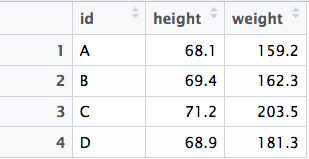

```{r set_knitr_options, echo=FALSE, message=FALSE, warning=FALSE}
suppressMessages(library(knitr))
opts_chunk$set(tidy=FALSE, cache=TRUE, echo=TRUE, message=FALSE)
```

## Learning objectives

You will learn:

* How to access, assign and display data in R
* How to call functions
* How to use vectorized operations
* How to store, load, and remove data
* How to make comments in R code

## Accessing Data

If you just enter a value at the R command prompt, R will print out the value 
to your screen:

```{r}
68.1
```

Or you can call the `print()` function instead (to be explicit about it):

```{r}
print('A')
```

## Variable assignment with `<-`

You can store data in memory by *assigning* values to variables (using `<-`).

```{r}
number <- 68.1
number
```

This value will be stored in your computer's memory for the duration of the 
current session, or until it is modified or deleted by you, your code, or your
environment (execution context).

The `<-` (arrow) symbol is used as the primary assignment operator in R.

You can also use the `=` symbol for the assignment operator, but it is not 
as commonly used in R, except for argument assignment in function calls.

## Argument assignment with `=`

In this function call, we use the `=` symbol to tell R that the expected 
argument (parameter) `x` should take the value of our `number` variable.

```{r}
print(x = number)
```

This assignment takes place within the function call and is not available 
outside of the function or after the function call is made.

Since the `x` argument is the first argument expected by the function, we do
not have to explicity assign our value to this argument, if we supply our
value as the first (or only) argument.

```{r}
print(number)
```

## Assignment operators

Just remember: 

* use `<-` for variable assignment 

```{r, eval = FALSE}
number <- 68.1
```

* use `=` for argument assignment within function calls

```{r, eval = FALSE}
print(x = number)
```

## Vectors

In R, a vector is a group of values or variables. You can create a 
vector from a collection of data values using the `c()` (combine) function.

```{r}
id <- c('A', 'B', 'C', 'D')
height <- c(68.1, 69.4, 71.2, 68.9)
weight <- c(159.2, 162.3, 203.5, 181.3)
```

Here, we created three vectors, which we may describe as follows:

* `id` is a character vector containing alphabetic indentifiers
* `height` is a numeric vector containing heights in inches
* `weight` is a numeric vector containing weights in pounds

More technically speaking, a vector is an ordered collection of one or more 
individual values of the same data type. 

In other computer languages this data structure would be called an array or a 
list, but R uses those terms for other, more complex data structures.

## Data types and classes

We can view the (underlying) data type of an object by using the `typeof()` function.

```{r}
typeof(id)
```

We can find the (higher order) category of an object with `class()`.

```{r}
class(id)
```

Both the type and class of a character vector is "character".

```{r}
is.vector(id)
```

We can see that our vector is indeed a vector even if the class is not.

## Data types and classes

```{r}
typeof(weight)
class(height)
```

The type of a numeric vector may be "double" or "integer". The class is "numeric".

The term "double" used above refers to data storage as a [double-precision 
floating point](https://en.wikipedia.org/wiki/Double-precision_floating-point_format) 
format (64 bit) number.

We will explore the various R data objects and their properties in depth in a 
later module.

## Data frames

You can store a two dimensional matrix of data (a "table") as a data frame. This
is the most common way to work with data in R. A data frame is often constructed
from one or more vectors.

```{r}
df <- data.frame(id, height, weight)
df
```

The rows represent observations or cases and the columns represent variables.

We can see that our data frame, `df`, is a data frame by using the `class()` 
function.

```{r}
class(df)
```

## Viewing data

You can see your data frame in a grid format by using the `View()` function.

```{r, eval = FALSE}
View(df)
```

This will open the data frame in a new window or tab and display it like a 
spreadsheet. 



However, unlike a spreadsheet, you will not be able to manipulate
your data in this display.

## Performing calculations

R is basically a calculator. You can use many built-in operators and functions.

```{r}
2*2
2/2
2^2
sqrt(2)
```

## Code Comments in R

The `#` is used for comments. Everthing after the `#` will be ignored by R.

```{r}
val <- 1234
val    # This is a bad name for a variable because it is not very descriptive.
```

The `#` symbol has several names:

* *__number sign__*: shorthand for &#8470; (*numero*, No.)
* *__pound sign__*: shorthand for &#8468; (*libra pondo*, lb.)
* *__hash__*: from "cross hatch"; popular with programmers (and also in the UK)
* *__hashtag__*: as used on social media sites like Twitter for keyword searching
* *__octothorpe__*: originated at Bell Labs for use with telephone keypads

In this tutorial, we will usually refer to it as a "hash" or "pound".

## Vectorized operations

R allows you to perform calculations on all items in a vector or all rows of a 
data frame at the same time. 

Operations that allow this are called *vectorized* operations. They are often 
much faster than the alternatives. 

Let's [calculate](https://www.cdc.gov/healthyweight/assessing/bmi/adult_bmi/index.html) the adult Body Mass Index (BMI), using our two vectors as input.

```{r}
# Calculate adult BMI from vectors: weight (in pounds) and height (in inches)
bmi <- (weight / height ^ 2) * 703
bmi
```

This creates a new vector of results and prints the vector to the screen.

You will want to make sure your input vectors have the same number of values 
(elements). If they do not match, you may see strange results.

## Vectorized operations versus loops

Alternatively, we could have used a loop to iterate through the input data. This
approach would calculate a single adult BMI for each loop iteration. 

We can implement this approach with a `for()` loop.

```{r}
# Initialize vector before use in body of loop
bmi <- NULL

# Calculate adult BMI using loop from values: weight (in pounds) and height (in inches)
for (i in 1:length(weight)) bmi[i] <- (weight[i] / height[i] ^ 2) * 703
bmi
```

Not only does this take more code it is also less efficient, since many more
operations (function calls) have to be performed.

## Vectorized operations versus loops

For comparison, let's create two data vectors with 100,000 values in each, by
randomly sampling from the normal distribution.

```{r}
set.seed(5)      # Start the random number generator reproducibly.
wt100k <- rnorm(n = 100000, mean = 175, sd = 30)
ht100k <- rnorm(n = 100000, mean = 65, sd = 3)
```

Then, time the two adult BMI calculation methods.

```{r}
system.time(bmi <- (wt100k / ht100k ^ 2) * 703)
system.time(for (i in 1:length(wt100k)) bmi[i] <- (wt100k[i] / ht100k[i] ^ 2) * 703)
```

Clearly, the loop approach takes longer to run than the vectorized approach.

## Vectorized operations with data frames

We can also perform this operation on columns of a data frame to produce a new
column.

```{r}
# Add a new column for adult BMI calculated from the weight and height columns
df$bmi <- (df$weight / df$height ^ 2) * 703
df
```

We performed the same BMI calculation as before, but this time on the columns 
of a data frame, adding a new column for the BMI.

## Storing and loading data

While we have seen how to create data objects using the assignment operator, 
`<-`, these objects only reside is our computer's volatile memory. Much of the
time, this is all we need to do in order to perform calculations on our data.

Sometimes we want to store our data on our disk drive or our network for long-term
storage or for sharing with collaborators. We can do this by saving the data as
a file using the `save()` function.

```{r}
save(df, file="df.rda")
```

You can read a data file and load it's contents in memory with `load()`.

```{r}
load("df.rda")
df
```

## Removing data

You can remove a data object from your working (volatile) memory with `rm()`.

```{r}
rm(df)
```

You can remove a file with `unlink()`.

```{r}
unlink("df.rda")
```


##

```{r child = '../questions.html'}
```
