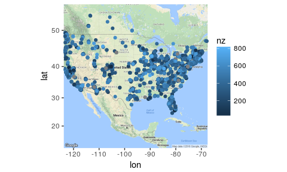

# Data Management in R
Brian High  
  


## Learning Objectives

You will learn:

* What data management is
* Common data management tasks in R
* Packages and functions used to manage data in R
* How to use these tools to perform data management tasks

## What is data management?

### Four Perspectives

1. **(Preparatory) Data Management** -- prepare data for analysis
2. **(Research) Data Management** -- preserve and share research data
3. **Data(base) Management**  -- design, build, secure, and maintain databases
4. **(Enterprise) Data Management** -- consolidate an entire organization's data

The subject of this module is primarily #1: **(Preparatory) Data Management**.

We will give some attention to #3: **Data(base) Management** in a later module. 

## Common data management tasks in R

### **ETL**: [Extract, Transform, and Load](https://en.wikipedia.org/wiki/Extract,_transform,_load)

These are terms used in (Enterprise) Data Management, but they are helpful for us too.

* **Extract**: **Import** raw data to **select** and **filter** just the data you need.
* **Transform**: **Convert** the raw data into a more organized and useful **structure**.
* **Load**: Bring transformed data into the data objects to be analyzed.

We will use this framework to help us make sense of the varied tasks of 
Preparatory Data Management.

## Extract

To extract data we usually start by reading the data into R. 

This will usually involve one of the following:

* import data from a package
* enter data manually
* read a file
* access data through the network
* query a database
* collect data directly from a sensor

We will often use the terms "import", "read", "load", etc. interchangeably.

## Import data from a package

We can use data that comes with packages by using the `data()` function.


```r
# Load the data from the package and show the first few rows
data(airquality)
head(airquality)
```

```
##   Ozone Solar.R Wind Temp Month Day
## 1    41     190  7.4   67     5   1
## 2    36     118  8.0   72     5   2
## 3    12     149 12.6   74     5   3
## 4    18     313 11.5   62     5   4
## 5    NA      NA 14.3   56     5   5
## 6    28      NA 14.9   66     5   6
```

The `data()` function loads the dataset supplied into the current workspace
envinronment (memory) so that you can work with it like an object you created.
You can look at the structure of the object with `str()` and you can learn about
the dataset with `help()`. List the many datasets that come with R's *datasets* 
package with `library(help = "datasets")`. The *MASS* package offers many more.

## Enter data manually

You can enter data by typing it in:

* as you work with the Console prompt
* as you type into your text editor
* as you work with other software like spreadsheets and databases

In particular, we can enter data ...

* into commands (such as assignment statements)
* into data entry screens like those offered by `fix()` and `edit()`
* into a data entry prompt, like that offered by the `scan()` function

## Read a file

Usually, we start by reading a file. Ideally, this is a well-formed CSV file.


```r
diversity <- read.csv('data/prepped.csv')
str(diversity)
```

```
## 'data.frame':	4815 obs. of  6 variables:
##  $ X   : Factor w/ 4815 levels "000001001.1053931",..: 1 2 3 4 5 6 7 8 9 10 ...
##  $ diet: Factor w/ 7 levels "no_data","Omnivore",..: 2 2 2 3 2 2 2 2 2 7 ...
##  $ lat : Factor w/ 268 levels "13.7","18.4",..: 175 174 172 177 268 173 173 173 172 173 ...
##  $ lon : Factor w/ 458 levels "-0.0","0.0","-0.1",..: 215 216 219 210 458 211 211 211 211 212 ...
##  $ nz  : int  481 181 296 139 398 91 834 565 267 620 ...
##  $ site: Factor w/ 10 levels "no_data","UBERON:feces",..: 2 2 2 2 2 2 2 2 2 2 ...
```

This is data from the [American Gut](http://americangut.org/) project, which 
has been pre-processed by a Python script published on a webpage for a 
[Geospacial Data Analysis](http://gsa.smallwhitecube.com/a/guts/) course.

We were able to read the file with no errors, but we still need to transform
the data to get it into a more usable structure.

## Viewing text files

Let's view the raw data as a text file. We could open it in a text editor, 
but sometimes data files are too big for that. Here's how we can do this in R:


```r
head(readLines('data/prepped.csv'))
```

```
## [1] ",diet,lat,lon,nz,site"                                                 
## [2] "000001001.1053931,Omnivore,42.6,-71.5,481,UBERON:feces"                
## [3] "000001002.1076104,Omnivore,42.5,-71.6,181,UBERON:feces"                
## [4] "000001004.1076113,Omnivore,42.3,-71.9,296,UBERON:feces"                
## [5] "000001008.1075990,Omnivore but no red meat,42.8,-71.0,139,UBERON:feces"
## [6] "000001011.1210950,Omnivore,no_data,no_data,398,UBERON:feces"
```

We see that the first line looks like colums labels (the "header"), and the
items look to be separated by commas, but can you see some problems here?

## Data transformation during import

We can use options to our import function to transform the data as it is read.

Since `lat` and `lon` should probably be `numeric` values, we can disable the
automatic conversion of `character` strings to `factors` with `stringsAsFactors = FALSE`.


```r
diversity <- read.csv('data/prepped.csv', 
                      stringsAsFactors = FALSE)
str(diversity)
```

```
## 'data.frame':	4815 obs. of  6 variables:
##  $ X   : chr  "000001001.1053931" "000001002.1076104" "000001004.1076113" "000001008.1075990" ...
##  $ diet: chr  "Omnivore" "Omnivore" "Omnivore" "Omnivore but no red meat" ...
##  $ lat : chr  "42.6" "42.5" "42.3" "42.8" ...
##  $ lon : chr  "-71.5" "-71.6" "-71.9" "-71.0" ...
##  $ nz  : int  481 181 296 139 398 91 834 565 267 620 ...
##  $ site: chr  "UBERON:feces" "UBERON:feces" "UBERON:feces" "UBERON:feces" ...
```

## Data transformation during import

The `lat` and `lon` are now `chr` (`character`) types. Why is that?

Remember when we looked at the text of the file with `readLines()`? What is the
value `no_data`.

We can see it again with `head()`.


```r
head(diversity)
```

```
##                   X                     diet     lat     lon  nz
## 1 000001001.1053931                 Omnivore    42.6   -71.5 481
## 2 000001002.1076104                 Omnivore    42.5   -71.6 181
## 3 000001004.1076113                 Omnivore    42.3   -71.9 296
## 4 000001008.1075990 Omnivore but no red meat    42.8   -71.0 139
## 5 000001011.1210950                 Omnivore no_data no_data 398
## 6 000001018.1075878                 Omnivore    42.4   -71.1  91
##           site
## 1 UBERON:feces
## 2 UBERON:feces
## 3 UBERON:feces
## 4 UBERON:feces
## 5 UBERON:feces
## 6 UBERON:feces
```

## Data transformation during import

Since `no_data` probably means "not available" (NA), we can specify that in our
command arguments.


```r
diversity <- read.csv('data/prepped.csv', 
                      stringsAsFactors = FALSE, na.strings = 'no_data')
str(diversity)
```

```
## 'data.frame':	4815 obs. of  6 variables:
##  $ X   : chr  "000001001.1053931" "000001002.1076104" "000001004.1076113" "000001008.1075990" ...
##  $ diet: chr  "Omnivore" "Omnivore" "Omnivore" "Omnivore but no red meat" ...
##  $ lat : num  42.6 42.5 42.3 42.8 NA 42.4 42.4 42.4 42.3 42.4 ...
##  $ lon : num  -71.5 -71.6 -71.9 -71 NA -71.1 -71.1 -71.1 -71.1 -71.2 ...
##  $ nz  : int  481 181 296 139 398 91 834 565 267 620 ...
##  $ site: chr  "UBERON:feces" "UBERON:feces" "UBERON:feces" "UBERON:feces" ...
```

Now, we see that `lat` and `lon` are `numeric`.

## Data transformation during import

We would like to import the `diet` and `site` columns as `factor`, since they
are categorical variables. We would also like to change the column name `X` to
`id`.

Let's manually specify the column names and the data types (classes).


```r
diversity <- read.csv('data/prepped.csv', 
                      stringsAsFactors = FALSE, na.strings = 'no_data',
                      col.names = c('id', 'diet', 'lat', 'lon', 'nz', 'site'), 
                      colClasses = c('diet' = 'factor', 'site' = 'factor'))
str(diversity)
```

```
## 'data.frame':	4815 obs. of  6 variables:
##  $ id  : chr  "000001001.1053931" "000001002.1076104" "000001004.1076113" "000001008.1075990" ...
##  $ diet: Factor w/ 6 levels "Omnivore","Omnivore but no red meat",..: 1 1 1 2 1 1 1 1 1 6 ...
##  $ lat : num  42.6 42.5 42.3 42.8 NA 42.4 42.4 42.4 42.3 42.4 ...
##  $ lon : num  -71.5 -71.6 -71.9 -71 NA -71.1 -71.1 -71.1 -71.1 -71.2 ...
##  $ nz  : int  481 181 296 139 398 91 834 565 267 620 ...
##  $ site: Factor w/ 9 levels "UBERON:feces",..: 1 1 1 1 1 1 1 1 1 1 ...
```

Okay, that's looking pretty good. We caould easily change the variable names here,
but they are fine. `nz` means "number of nonzero taxa" in the microbiome analysis
of that sample. It is a measure of diversity, so we could have renamed it `diversity`.

## Data transformation during import

What if our file did not have a header line? What if it did, but we wanted to
ignore (skip) it? What if we want to specify a different field separator?


```r
diversity <- read.csv('data/prepped.csv', header = FALSE, skip = 1, sep = ',',
                      stringsAsFactors = FALSE, na.strings = 'no_data',
                      col.names = c('id', 'diet', 'lat', 'lon', 'nz', 'site'), 
                      colClasses = c('diet' = 'factor', 'site' = 'factor'))
str(diversity)
```

```
## 'data.frame':	4815 obs. of  6 variables:
##  $ id  : chr  "000001001.1053931" "000001002.1076104" "000001004.1076113" "000001008.1075990" ...
##  $ diet: Factor w/ 6 levels "Omnivore","Omnivore but no red meat",..: 1 1 1 2 1 1 1 1 1 6 ...
##  $ lat : num  42.6 42.5 42.3 42.8 NA 42.4 42.4 42.4 42.3 42.4 ...
##  $ lon : num  -71.5 -71.6 -71.9 -71 NA -71.1 -71.1 -71.1 -71.1 -71.2 ...
##  $ nz  : int  481 181 296 139 398 91 834 565 267 620 ...
##  $ site: Factor w/ 9 levels "UBERON:feces",..: 1 1 1 1 1 1 1 1 1 1 ...
```

If we were not reading a `CSV` file, but perhaps a tab-delimited file, we could
use the same syntax, but with the `read.table()` function and a different `sep`
character.

## Saving our work

We can, and should, script all transformation we do on our data, and keep
those scripts and the intermediate data files we create.

How could we save our changes to `diversity` to make it easier to use the 
data later?


```r
# Save our data frame for later
write.csv(diversity, "diversity.csv", row.names = FALSE)

# Read 'diversity.csv' into a new data frame
diversity <- read.csv('diversity.csv', colClasses = c('id' = 'character'))
```

When re-reading the file, we are able to use a simpler `read.csv` command, since
much of the data transformation had already been done before the file was saved,
or is done by default by the `read.csv` command. 

For example, `read.csv` will label the columns and figure out which data types 
to use, though we need to tell it not to make `id` a factor, which it would by 
default. These behaviors may be turned off. See `help(read.table)` for more 
information about`read.csv` and `read.table`.

## Other ways to do it: `read_delim`

Newer R packages offer more computationally efficient functions for doing
common tasks like importing data files. 

Here is how you could perform the same import with `read_delim` from the 
*readr* package.


```r
# install.packages("readr", repos = 'http://cran.r-project.org')
library(readr)

diversity <- read_delim('prepped.csv', delim = ',', skip = 1, na = c('', 'no_data'),
                        col_names = c('id', 'diet', 'lat', 'lon', 'nz', 'site'))

diversity$diet <- as.factor(diversity$diet)
diversity$site <- as.factor(diversity$site)
```

`read_delim()` will read the file into a `tbl_df` object. `read_delim` will
not convert character strings to factors by default. In fact, if you want 
factors, you have create tham after the import. The *readr* package and its
functions and data types are recent innovations and promise to offer enhanced
functionality and higher performance.

## Other ways to do it: `fread`

And here is how you might try this with `fread` from the *data.table* package.


```r
# install.packages("data.table", repos = 'http://cran.r-project.org')
library(data.table)

diversity <- fread('prepped.csv', header = FALSE, skip = 1, sep = ',',
                   na.strings = c('', 'no_data'), stringsAsFactors = FALSE,
                   col.names = c('id', 'diet', 'lat', 'lon', 'nz', 'site'))

factor.cols <- c('diet', 'site')
diversity[, (factor.cols) := lapply(.SD, as.factor), .SDcols = factor.cols]
```

`data.table` offers an enhanced bracket-notation for subsetting, filtering, 
and modifying data. It also offersing indexing for fast sorting and joins, 
much like a database.

`fread()` will return a `data.table`. Both `fread` and `data.table` are highly 
optimized, and will run much faster when used with large data files.

## What is this data good for?


```r
# install.packages(c("ggplot2", "ggmap"), repos = 'http://cran.r-project.org')
library(ggplot2); library(ggmap)

# Produce a scatter-plot map of 'nz' (number of nonzero taxa) plotted on a US map
usa <- get_map("USA", zoom=4)
ggmap(usa) + geom_point(aes(x = lon, y = lat, color = nz), data = diversity) +
    scale_colour_gradient(limits = quantile(diversity$nz, probs = c(.025, .975)))
```



## ETL in a single function

With only `read.csv()` or `read.table()` we were able to:

* **extract** the data we wanted (all except the first line) from the raw data file
* **transform** it to the proper data types (classes) and properly identify `NA` values
* **load** it into a data frame structure for use with the `ggmap()` function

We could have performed those tasks with individual functions after the data
were imported. It was less work to do it this way, and is probably more efficient.

By manually specifying the data types for each column, we did not have to burden
the computer which having to determine these types itself.

## Data "munging" and data "wrangling"

The **transform** step is commonly referred to data "munging" or data "wrangling" 
in the data analysis world. 

Here is a short list of some of the popular data wrangling functions.

* `base` functions: `names`, `subset`, `merge`, `match`, `gsub`, `unique`, `sort`
* `stats` functions: `aggregate`, `reshape`, `na.omit`
* `dplyr` functions: `select`, `filter`, `group_by`, `summarize`, `arrange`, `join`, `mutate`
* `tidyr` functions: `gather`, `separate`, `unite`, `spread`

We will spend more time with these packages and functions in a later module.

## R, Databases, and Big Data

We might want to put our data into a database if:

* There is a lot of it (and access would be slow or resource-intensive)
* It comes from a lot of different sources (and needs to be merged)
* The data will need to be shared (possibly by many users at once)
* Several different applications will access it (in a common format)
* The data needs to be extra secure (not on workstations or laptops)

We will look at how to create and use databases from R in a later module.

If we have extra time, we also spend some time on R and Big Data.
