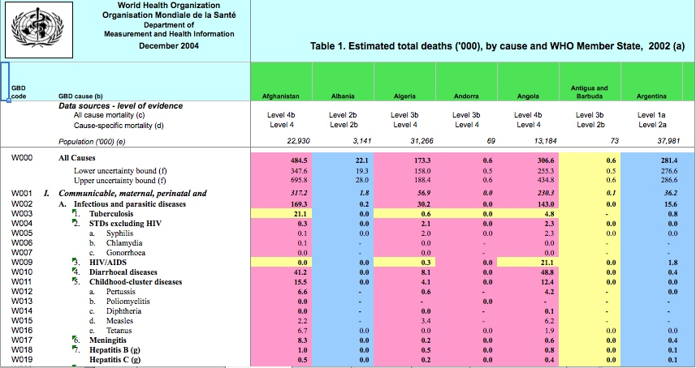

```{r set_knitr_options, echo=FALSE, message=FALSE}
suppressMessages(library(knitr))
opts_chunk$set(tidy=FALSE, cache=TRUE, echo=TRUE, message=FALSE)
```

## Learning Objectives

You will learn:

* What data "wrangling" and "munging" are and why you should care
* What "tidy data" is and how to achieve it
* Packages and functions used to tidy and wrangle data in R
* How to tidy and wrangle data with R

## What is "data wrangling"?

[data wrangling](https://en.wikipedia.org/wiki/Data_wrangling) is:

> Transforming "raw" data into a more useful format through clever methods.

[Webster's Dictionary](http://www.merriam-webster.com/dictionary/wrangle) defines 
"wrangle" as:

* to argue angrily with someone
* to get (something) by **_clever methods_** or by persuading someone
* to **_control and care for_** (horses, cattle, etc.) on a ranch

Other (related) terms, which may form a part of the wrangling process:

* Data "munging" (like "wrangling" but more hackish)
* Data cleaning
* Data conversion
* Data reshaping
* Data formatting
* Data tidying

## Data "wrangling" and "munging"

The [ETL](https://en.wikipedia.org/wiki/Extract,_transform,_load) **transform** 
step is commonly referred to [data wrangling](https://en.wikipedia.org/wiki/Data_wrangling) or [munging](https://en.wikipedia.org/wiki/Mung_(computer_term)) in the data analysis 
world. 

Here is a short list of some of the more popular data wrangling (or munging) functions in R.

* *base* functions: `names`, `subset`, `merge`, `match`, `gsub`, `unique`, `sort`
* *stats* functions: `aggregate`, `reshape`, `na.omit`
* *dplyr* functions: `select`, `filter`, `group_by`, `summarize`, `arrange`, `join`, `mutate`
* *tidyr* functions: `gather`, `separate`, `unite`, `spread`

*Data munging is one of [the three sexy skills of data geeks](http://medriscoll.com/post/4740157098/the-three-sexy-skills-of-data-geeks). -- @medriscoll*

## Example: Wrangling "Malaria Cases"

Search the World Bank database using the *WDI* package to find cases of Malaria 
in Central America (and Mexico) and plot the count of cases by country and year.

Start by searching the database for the term "malaria cases".

```{r, message=FALSE}
library(WDI)
WDIsearch("malaria cases")                # Search by (partial) report name
Malaria <- WDI(indicator='SH.STA.MALR')   # Fetch dataset by indicator
str(Malaria)                              # Show the structure of the dataset
```

## Example: Wrangling "Malaria Cases"

Get the 2-letter country codes (ISO 3166) for Central America. A search for 
various terms in `WDI` does not turn up the list we need. Get this list elsewhere.

There is a *ISOcodes* package, but its `ISO_3166_2` dataset does not include 
the sub-region names. See: `library(help="ISOcodes")` 

The list, with sub-region names, was found by searching (Googling) for these terms:

`"iso 3166" "sub-region" filetype:csv`

```{r}
data.folder <- 'data'
dir.create(data.folder, showWarnings = FALSE)   # Create data folder if needed

iso2c.file <- file.path(data.folder, 'iso2c.csv')

# Only download the file if it does not already exist
if (! file.exists(iso2c.file)) {
    # Split URL into several variables so the line doesn't wrap :p
    site <- 'https://raw.githubusercontent.com'
    repo <- 'lukes/ISO-3166-Countries-with-Regional-Codes'
    file <- 'master/all/all.csv'
    download.file(paste(site, repo, file, sep='/'), iso2c.file)
}
```

## Example: Wrangling "Malaria Cases"

Import the CSV file and clean up the data using the *dplyr* package:

* read the CSV file with `read.csv`
* filter for Central American countries with `filter`
* select the only the two columns we need with `select`

```{r}
library(dplyr)
codes <- read.csv(iso2c.file, header=TRUE, stringsAsFactors = FALSE)
codesCA <- codes %>% filter(sub.region == 'Central America') %>% 
    select(c(name, iso2c = alpha.2)) %>% arrange(iso2c)
codesCA
```

## Example: Wrangling "Malaria Cases"

Using the *dplyr* package (and a few others), clean up the data:

* "Pipe" data between operations using `%>%` (from the *magrittr* package)
* rename columns with the `rename` function
* remove NAs with the `na.omit` function (from the *stats* package)
* filter by country with `filter` using the `%in%` (match) operator
* sort by 2-letter country code and year with `arrange`

```{r, message=FALSE}
MalariaCA <- Malaria %>% rename(cases = SH.STA.MALR) %>% na.omit() %>% 
    filter(iso2c %in% codesCA[,'iso2c']) %>% arrange(iso2c, year)
head(MalariaCA)
```

## Example: Wrangling "Malaria Cases"

Make a stacked-bar plot of Malaria cases by year and colored by country.

```{r malaria-ggplot}
library(ggplot2)
ggplot(MalariaCA, aes(x=year, y=cases, fill=country)) + geom_bar(stat="identity") + 
    ggtitle("Malaria Cases in Central America\nby Year (Source: World Bank)")
```

## Quick Example: `mutate` and `ggplot`

We can do data wrangling and plotting in a single command. First let's look at a 
dataset.

```{r}
library(datasets)
data(iris)
str(iris)
```

## Quick Example: `mutate` and `ggplot`

We can "pipe" data directly to `ggplot`.

```{r no-facets-1}
iris %>% ggplot(., aes(x=Petal.Width, y=Petal.Length, color=Species)) + geom_point()
```

## Quick Example: `mutate` and `ggplot`

Therefore, we can also pipe to `mutate` and then to `ggplot`.

```{r no-facets-2}
iris %>% mutate(ratio.sep = Sepal.Width/Sepal.Length) %>%
         ggplot(., aes(x=Petal.Width, y=ratio.sep, color=Species)) + geom_point()
```

## So what about "tidy data"?

*[data tidying](https://cran.r-project.org/web/packages/tidyr/vignettes/tidy-data.html): structuring datasets to facilitate analysis -- @hadleywickham*

According to [Hadley Wickham](https://github.com/hadley), tidy data:

* Each variable forms a column.
* Each observation forms a row.
* Each type of observational unit forms a table.

So far, our datasets have all come with this basic structure.

Let's look at some "untidy" data...

## Untidy data: Aaargh!!



## Tidying data

[Hadley Wickham](https://github.com/hadley), creator of the *ggplot2*, *dplyr*, 
and many other popular packages, has also given us the [tidyr](https://cran.r-project.org/web/packages/tidyr/index.html) package.

From `library(help="tidyr")`, we will find some of the most important functions
in this package:

```
gather                  Gather columns into key-value pairs.
spread                  Spread a key-value pair across multiple columns.

extract                 Extract one column into multiple columns.
separate                Separate one column into multiple columns.
unite                   Unite multiple columns into one.
```

Let's see some of these in action with an example...

## Tidy Data Example: Iris

The `iris` dataset that comes with R has a strange structure.

```{r}
library(datasets)
data("iris")
str(iris)
```

See how the columns are named? What tidy data requirement has been violated?

## Plot with facets

```{r facet-1}
qplot(x=Sepal.Width, y=Sepal.Length, data=iris, geom=c("point"),
      color=Species, facets=Species~.)
```

## Tidy Data Example: Iris

How would we facet on flower part **and** `Species` (in a single plot)?

A column names like `Sepal.Length` and `Sepal.Width` store a flower part (Sepal)
with a measurement (Length and Width). This is an example of a "wide" format.

This naming violates the principle of "each variable forms a column", since a 
flower part and a dimension measurement are two different variables. 
It matters because we also have `Petal.Length` and `Petal.Width`.

We want a structure which separates the measument type information from the 
flower part information. 

This will give us a column for flower part which we can use for our plot facets.
This will be a longer (narrower) table structure with more rows. 

We will double the number of rows from 150 to 300 -- for 150 individual flowers.

## dplyr: `mutate`

Using `mutate`, add a column to keep track of the flower id (`iris_id`.)

```{r}
iris_id <- mutate(iris, flower_id = rownames(iris))
head(iris_id)
```

## tidyr: `gather`

Convert wide data format to long format.

```{r}
library(tidyr)
iris_gathered <- gather(iris_id, variable, value, c(-Species, -flower_id))
head(iris_gathered)
```

## tidyr: `extract`

Remove the `variable` column and add new columns for the parsed values. 

```{r}
iris_parsed <- extract(iris_gathered, variable, 
                       c("flower_part", "measurement_type"), "(.+)\\.(.+)")
head(iris_parsed)
```

The string `"(.+)\\.(.+)"` is a 
[regular expression](https://en.wikipedia.org/wiki/Regular_expression) 
that uses [grouping](https://regexone.com/lesson/capturing_groups) to parse the 
text into groups which `extract` uses to fill the new `flower_part` and 
`measurement_type` variables.

## tidyr: `spread`

Go back to a wider format. Convert `measurement_type` and `value` to columns
named `Length` and `Width`.

```{r}
iris_spread <- spread(iris_parsed, measurement_type, value)
head(iris_spread)
```

This is now a tidy dataset because each each variable forms a column
and no column (name) contains any other kind of information. Now  we can facet
on both `flower_part` **_and_** `Species`.

## Plot with facets

```{r facet-2}
qplot(x=Width, y=Length, data=iris_spread, geom=c("point"), size=I(0.3),
      color=Species, facets=flower_part~Species)
```

## Plot with facets

```{r facet-3}
ggplot(data=iris_spread, aes(x=Width, y=Length)) + 
    geom_point(size=I(0.5)) + facet_grid(Species~flower_part, scale="free") +
    geom_smooth(method="lm") + theme_bw(base_size=16)
```

## More Data Wrangling

If you have time and interest, you may continue with 
[more data wrangling](https://github.com/brianhigh/research-computing/blob/master/lab/Data_Wrangling.md), 
courtesy of Noah Simon and Ali Shojaie.

Or you might want to try the Swirl tutorials for [Getting and Cleaning Data](https://github.com/swirldev/swirl_courses/tree/master/Getting_and_Cleaning_Data). 

```{r, eval=FALSE}
library(swirl)
install_from_swirl("Getting and Cleaning Data")
swirl()
```