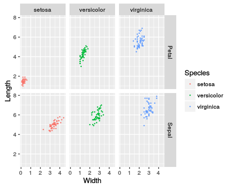
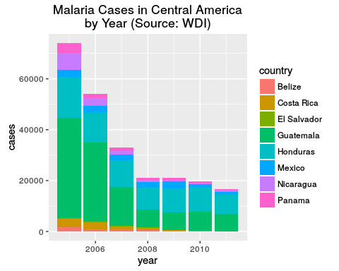
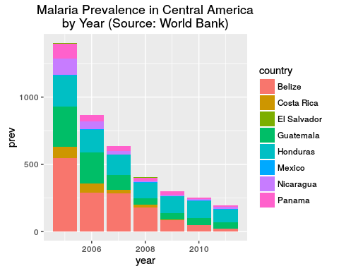
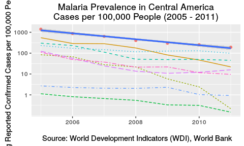
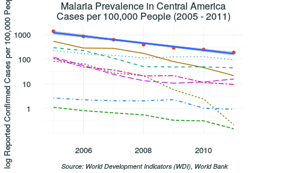
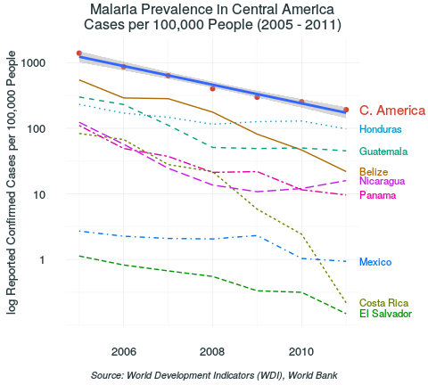

# Data Wrangling in R
Brian High  
  


## Learning Objectives

You will learn:

* What data "wrangling" and "munging" are and why you should care
* What "tidy data" is and how to achieve it
* Packages and functions used to tidy and wrangle data in R
* How to tidy and wrangle data with R
* How to create and customize plots with `qplot` and `ggplot`

## What is "data wrangling"?

[data wrangling](https://en.wikipedia.org/wiki/Data_wrangling) is:

> Transforming "raw" data into a more useful format through clever methods.

[Webster's Dictionary](http://www.merriam-webster.com/dictionary/wrangle) defines 
"wrangle" as:

* to argue angrily with someone
* to get (something) by **_clever methods_** or by persuading someone
* to **_control and care for_** (horses, cattle, etc.) on a ranch

Other (related) terms, which may form a part of the wrangling process:

* Data "munging" (like "wrangling" but more hackish)
* Data cleaning
* Data conversion
* Data reshaping
* Data formatting
* Data tidying

## Data "wrangling" and "munging"

The [ETL](https://en.wikipedia.org/wiki/Extract,_transform,_load) **transform** 
step is commonly referred to [data wrangling](https://en.wikipedia.org/wiki/Data_wrangling) or [munging](https://en.wikipedia.org/wiki/Mung_(computer_term)) in the data analysis 
world. 

Here is a short list of some of the more popular data wrangling (or munging) functions in R.

| Package | Functions
| ------- | ---------
| base    | names, subset, merge, match, gsub, unique, sort
| stats   | aggregate, reshape, na.omit
| dplyr   | select, filter, group_by, summarize, arrange, join, mutate
| tidyr   | gather, separate, unite, spread

*Data munging is one of [the three sexy skills of data geeks](http://medriscoll.com/post/4740157098/the-three-sexy-skills-of-data-geeks). -- @medriscoll*

## Quick Example: Iris Dataset

We can do data wrangling and plotting in a single command. First let's look at a 
dataset.


```r
library(datasets)
data(iris)
str(iris)
```

```
## 'data.frame':	150 obs. of  5 variables:
##  $ Sepal.Length: num  5.1 4.9 4.7 4.6 5 5.4 4.6 5 4.4 4.9 ...
##  $ Sepal.Width : num  3.5 3 3.2 3.1 3.6 3.9 3.4 3.4 2.9 3.1 ...
##  $ Petal.Length: num  1.4 1.4 1.3 1.5 1.4 1.7 1.4 1.5 1.4 1.5 ...
##  $ Petal.Width : num  0.2 0.2 0.2 0.2 0.2 0.4 0.3 0.2 0.2 0.1 ...
##  $ Species     : Factor w/ 3 levels "setosa","versicolor",..: 1 1 1 1 1 1 1 1 1 1 ...
```

## Quick Example: Pipe to `ggplot`

We can "pipe" data directly to `ggplot`.


```r
library(dplyr); library(ggplot2)
iris %>% ggplot(., aes(x=Petal.Width, y=Petal.Length, color=Species)) + geom_point()
```


## Quick Example: Mutation on the Fly

Therefore, we can also pipe to `mutate` and then to `ggplot`.


```r
iris %>% mutate(ratio.sep = Sepal.Width/Sepal.Length) %>%
         ggplot(., aes(x=Petal.Width, y=ratio.sep, color=Species)) + geom_point()
```


## Tidy Data

*[data tidying](https://cran.r-project.org/web/packages/tidyr/vignettes/tidy-data.html): structuring datasets to facilitate analysis -- @hadleywickham*

According to [Hadley Wickham](https://github.com/hadley), tidy data:

* Each variable forms a column.
* Each observation forms a row.
* Each type of observational unit forms a table.

So far, our datasets have all come with this basic structure.

Let's look at some "untidy" data...

## Untidy Data: Aaargh!!


## Tidying data

[Hadley Wickham](https://github.com/hadley), creator of the *ggplot2*, *dplyr*, 
and many other popular packages, has also given us the [tidyr](https://cran.r-project.org/web/packages/tidyr/index.html) package.

From `library(help="tidyr")`, we will find some of the most important functions
in this package:

| Function    | Description
| ----------- | -----------
| gather      | Gather columns into key-value pairs.
| spread      | Spread a key-value pair across multiple columns.
| extract     | Extract one column into multiple columns.
| separate    | Separate one column into multiple columns.
| unite       | Unite multiple columns into one.

Let's see some of these in action with an example...

## Tidy Data Example: Iris

The `iris` dataset that comes with R has a strange structure.


```r
library(datasets)
data("iris")
str(iris)
```

```
## 'data.frame':	150 obs. of  5 variables:
##  $ Sepal.Length: num  5.1 4.9 4.7 4.6 5 5.4 4.6 5 4.4 4.9 ...
##  $ Sepal.Width : num  3.5 3 3.2 3.1 3.6 3.9 3.4 3.4 2.9 3.1 ...
##  $ Petal.Length: num  1.4 1.4 1.3 1.5 1.4 1.7 1.4 1.5 1.4 1.5 ...
##  $ Petal.Width : num  0.2 0.2 0.2 0.2 0.2 0.4 0.3 0.2 0.2 0.1 ...
##  $ Species     : Factor w/ 3 levels "setosa","versicolor",..: 1 1 1 1 1 1 1 1 1 1 ...
```

See how the columns are named? What tidy data requirement has been violated?

* Each variable forms a column.
* Each observation forms a row.
* Each type of observational unit forms a table.

## qplot: Plot with facets


```r
qplot(x=Sepal.Width, y=Sepal.Length, data=iris, geom=c("point"),
      color=Species, facets=Species~.)
```


## Iris Data Wrangling

How would we facet on flower part **and** `Species` (in a single plot)?

A column names like `Sepal.Length` and `Sepal.Width` store a flower part (Sepal)
with a measurement (Length and Width). This is an example of a "wide" format.

This naming violates the principle of "each variable forms a column", since a 
flower part and a dimension measurement are two different variables. 
It matters because we also have `Petal.Length` and `Petal.Width`.

We want a structure which separates the measument type information from the 
flower part information. 

This will give us a column for flower part which we can use for our plot facets.
This will be a longer (narrower) table structure with more rows. 

We will double the number of rows from 150 to 300 -- for 150 individual flowers.

## dplyr: `mutate`

Using `mutate`, add a column to keep track of the flower id (`iris_id`.)


```r
iris_id <- mutate(iris, flower_id = rownames(iris))
head(iris_id)
```

```
##   Sepal.Length Sepal.Width Petal.Length Petal.Width Species flower_id
## 1          5.1         3.5          1.4         0.2  setosa         1
## 2          4.9         3.0          1.4         0.2  setosa         2
## 3          4.7         3.2          1.3         0.2  setosa         3
## 4          4.6         3.1          1.5         0.2  setosa         4
## 5          5.0         3.6          1.4         0.2  setosa         5
## 6          5.4         3.9          1.7         0.4  setosa         6
```

## tidyr: `gather`

Convert wide data format to long format.


```r
library(tidyr)
iris_gathered <- gather(iris_id, variable, value, c(-Species, -flower_id))
head(iris_gathered)
```

```
##   Species flower_id     variable value
## 1  setosa         1 Sepal.Length   5.1
## 2  setosa         2 Sepal.Length   4.9
## 3  setosa         3 Sepal.Length   4.7
## 4  setosa         4 Sepal.Length   4.6
## 5  setosa         5 Sepal.Length   5.0
## 6  setosa         6 Sepal.Length   5.4
```

## tidyr: `extract`

Remove the `variable` column and add new columns for the parsed values. 


```r
iris_parsed <- extract(iris_gathered, variable, 
                       c("flower_part", "measurement_type"), "(.+)\\.(.+)")
head(iris_parsed)
```

```
##   Species flower_id flower_part measurement_type value
## 1  setosa         1       Sepal           Length   5.1
## 2  setosa         2       Sepal           Length   4.9
## 3  setosa         3       Sepal           Length   4.7
## 4  setosa         4       Sepal           Length   4.6
## 5  setosa         5       Sepal           Length   5.0
## 6  setosa         6       Sepal           Length   5.4
```

The string `"(.+)\\.(.+)"` is a 
[regular expression](https://en.wikipedia.org/wiki/Regular_expression) 
that uses [grouping](https://regexone.com/lesson/capturing_groups) to parse the 
text into groups which `extract` uses to fill the new `flower_part` and 
`measurement_type` variables.

## tidyr: `spread`

Go back to a wider format. Convert `measurement_type` and `value` to columns
named `Length` and `Width`.


```r
iris_spread <- spread(iris_parsed, measurement_type, value)
head(iris_spread)
```

```
##   Species flower_id flower_part Length Width
## 1  setosa         1       Petal    1.4   0.2
## 2  setosa         1       Sepal    5.1   3.5
## 3  setosa        10       Petal    1.5   0.1
## 4  setosa        10       Sepal    4.9   3.1
## 5  setosa        11       Petal    1.5   0.2
## 6  setosa        11       Sepal    5.4   3.7
```

This is now a tidy dataset because each each variable forms a column
and no column (name) contains any other kind of information. Now  we can facet
on both `flower_part` **_and_** `Species`.

## qplot: Plot with more facets


```r
qplot(x=Width, y=Length, data=iris_spread, geom=c("point"), size=I(0.3),
      color=Species, facets=flower_part~Species)
```



## ggplot: Plot with more facets


```r
ggplot(data=iris_spread, aes(x=Width, y=Length)) + 
    geom_point(size=I(0.5)) + facet_grid(Species~flower_part, scale="free") +
    geom_smooth(method="lm") + theme_bw(base_size=16)
```


## Example: Wrangling Malaria Cases

Search the World Bank database using the *WDI* package to find cases of 
[Malaria](http://worldbank.270a.info/classification/indicator/SH.STA.MALR.html) 
in Central America (and Mexico) and plot the count of cases by country and year.


```r
library(WDI)
WDIsearch("malaria cases")                # Search by (partial) report name
```

```
##      indicator          name                                     
## [1,] "SH.MLR.CSES.TOTL" "Reported clinical malaria cases (total)"
## [2,] "SH.STA.MALR"      "Malaria cases reported"
```

```r
Malaria <- WDI(indicator='SH.STA.MALR')   # Fetch dataset by indicator
str(Malaria)                              # Show the structure of the dataset
```

```
## 'data.frame':	1806 obs. of  4 variables:
##  $ iso2c      : chr  "1A" "1A" "1A" "1A" ...
##  $ country    : chr  "Arab World" "Arab World" "Arab World" "Arab World" ...
##  $ SH.STA.MALR: num  NA NA NA NA NA NA NA NA NA NA ...
##  $ year       : num  2011 2010 2009 2008 2007 ...
```

NOTE: The default year range for a `WDI()` query is: 2005 - 2011.

## Getting 2-Letter Country Codes

Get the 2-letter country codes (ISO 3166) for Central America. A search for 
various terms in `WDI` does not turn up the list we need. Get this list elsewhere.

There is a *ISOcodes* package, but its `ISO_3166_2` dataset does not include 
the sub-region names. See: `library(help="ISOcodes")` 

The list, with sub-region names, was found by searching (Googling) for these terms:

`"iso 3166" "sub-region" filetype:csv`


```r
data.folder <- 'data'
dir.create(data.folder, showWarnings = FALSE)   # Create data folder if needed

iso2c.file <- file.path(data.folder, 'iso2c.csv')

# Only download the file if it does not already exist
if (! file.exists(iso2c.file)) {
    # Split URL into several variables so the line doesn't wrap :p
    site <- 'https://raw.githubusercontent.com'
    repo <- 'lukes/ISO-3166-Countries-with-Regional-Codes'
    file <- 'master/all/all.csv'
    download.file(paste(site, repo, file, sep='/'), iso2c.file)
}
```

## Wrangling Country Codes

Import the CSV file and then clean up the data using the *dplyr* package:

* read the CSV file with `read.csv`
* filter for Central American countries with `filter`
* select the only the two columns we need with `select`


```r
codes <- read.csv(iso2c.file, header=TRUE, stringsAsFactors = FALSE)
codesCA <- codes %>% filter(sub.region == 'Central America') %>% 
    select(c(name, iso2c = alpha.2)) %>% arrange(iso2c)
codesCA
```

```
##          name iso2c
## 1      Belize    BZ
## 2  Costa Rica    CR
## 3   Guatemala    GT
## 4    Honduras    HN
## 5      Mexico    MX
## 6   Nicaragua    NI
## 7      Panama    PA
## 8 El Salvador    SV
```

## Wrangling Malaria Cases

Using the *dplyr* package (and a few others), clean up the data:

* "Pipe" data between operations using `%>%` (from the *magrittr* package)
* rename columns with the `rename` function
* remove NAs with the `na.omit` function (from the *stats* package)
* filter by country with `filter` using the `%in%` (match) operator
* sort by 2-letter country code and year with `arrange`


```r
MalariaCA <- Malaria %>% rename(cases = SH.STA.MALR) %>% na.omit() %>% 
    filter(iso2c %in% codesCA[,'iso2c']) %>% arrange(iso2c, year)
head(MalariaCA)
```

```
##   iso2c country cases year
## 1    BZ  Belize  1549 2005
## 2    BZ  Belize   844 2006
## 3    BZ  Belize   845 2007
## 4    BZ  Belize   540 2008
## 5    BZ  Belize   256 2009
## 6    BZ  Belize   150 2010
```

## Plotting Malaria Cases by Year

Make a stacked-bar plot of Malaria cases by year and colored by country.


```r
ggplot(MalariaCA, aes(x=year, y=cases, fill=country)) + geom_bar(stat="identity") + 
    ggtitle("Malaria Cases in Central America\nby Year (Source: World Bank)")
```



## Example: Malaria Prevalence

Let's calculate the Malaria prevalence as the count of Malaria cases per 100,000
people for each of the countries of Central America and Mexico. We will need
to know the total 
[population](http://worldbank.270a.info/classification/indicator/SP.POP.TOTL.html) 
for each contry for each year.


```r
WDIsearch("population, total")          # Search database for indicator
```

```
##           indicator                name 
##       "SP.POP.TOTL" "Population, total"
```

```r
Pop <- WDI(indicator='SP.POP.TOTL')     # Fetch dataset by indicator
MalPop <- inner_join(Malaria, Pop, by = c("country", "iso2c", "year"))

MalCA <- MalPop %>% mutate(prev = 100000 * SH.STA.MALR/SP.POP.TOTL) %>%
    na.omit() %>% filter(iso2c %in% codesCA[,'iso2c']) %>% arrange(iso2c, year)
```

## Malaria Prevalence Bar Plot


```r
ggplot(MalCA, aes(x=year, y=prev, fill=country)) + geom_bar(stat="identity") +
     ggtitle("Malaria Prevalence in Central America\nby Year (Source: World Bank)")
```



## Malaria Prevalence Wrangling

It looks like prevalence is decreasing exponentially over time. Calculate the
sum of the prevalences by year to get group totals, then log transform the totals.


```r
MalCASum <- MalCA %>% group_by(year) %>% summarize(prev=sum(prev)) %>% 
    mutate(logprev=log(prev))
MalCASum
```

```
## # A tibble: 7 × 3
##    year      prev  logprev
##   <dbl>     <dbl>    <dbl>
## 1  2005 1399.8274 7.244104
## 2  2006  868.0805 6.766284
## 3  2007  634.5694 6.452947
## 4  2008  401.9646 5.996364
## 5  2009  297.8987 5.696754
## 6  2010  253.2026 5.534190
## 7  2011  191.9583 5.257278
```

## Malaria Prevalence Linear Model Fit

Check the fit of a linear model with the log prevalence as the response and 
year as the predictor.


```r
summary(lm(logprev ~ year, MalCASum))
```

```
## 
## Call:
## lm(formula = logprev ~ year, data = MalCASum)
## 
## Residuals:
##        1        2        3        4        5        6        7 
##  0.12502 -0.02491 -0.01036 -0.13905 -0.11078  0.05455  0.10552 
## 
## Coefficients:
##              Estimate Std. Error t value Pr(>|t|)    
## (Intercept) 664.53420   42.28282   15.72 1.90e-05 ***
## year         -0.32789    0.02106  -15.57 1.98e-05 ***
## ---
## Signif. codes:  0 '***' 0.001 '**' 0.01 '*' 0.05 '.' 0.1 ' ' 1
## 
## Residual standard error: 0.1114 on 5 degrees of freedom
## Multiple R-squared:  0.9798,	Adjusted R-squared:  0.9758 
## F-statistic: 242.5 on 1 and 5 DF,  p-value: 1.985e-05
```

## Malaria Prevalence Scatter Plot

Make a scatter plot of log prevalence per year with a linear regression line.


```r
ggplot(MalCASum, aes(x = year, y = logprev)) + geom_point() + 
    geom_smooth(method="lm")
```


## Malaria Prevalence Line Plot

Let's make a line plot by country to show the trends for each country more clearly.


```r
g <- ggplot(MalCA, aes(x = year, y = prev, color = country, linetype = country)) + 
     geom_line()
g
```


## Y-Axis Scale Log Transform

Log transform the y-axis to spread out the lines in lower end of the range.


```r
g <- g + scale_y_continuous(trans = "log", breaks = c(1, 5, 10, 50, 100, 500, 1000))
g
```


## Add Summarized Points and Smoother

Add the points and smooth line from the summarized dataframe. Hide the legend.


```r
g <- g + geom_point(data = MalCASum, inherit.aes = FALSE, 
                    aes(x = year, y = prev, color = '')) +
    geom_smooth(data = MalCASum, method = 'lm', inherit.aes = FALSE, 
                aes(x = year, y = prev)) + theme(legend.position = "none")
g
```


## Add Title, Axis Labels, and Caption

Add a plot title, axis labels and a caption.


```r
g <- g + ggtitle("Malaria Prevalence in Central America", 
                 subtitle = paste('Reported cases per 100,000 people (',
                   min(MalCA$year), ' - ', max(MalCA$year), ')', sep = '')) + 
     labs(x = "Year", y = "log Prevalence",
          caption = "Source: World Development Indicators (WDI), World Bank")
g
```



## Define Custom Plot Theme

Define a custom theme to set the text options, margins, and remove the legend.


```r
text.color <- "#25383C"        # Dark Slate Grey

my.title <- element_text(hjust = 0.5, color=text.color)
my.text <- element_text(colour = text.color)
my.caption <- element_text(margin=margin(t=15), face = "italic", 
                           size = 8, hjust = 0.5, color=text.color)

my.theme <- theme(axis.title.x = my.title, axis.title.y = my.title,
                  axis.text.x = my.text, axis.text.y = my.text,
                  plot.title = my.title, plot.subtitle = my.title,
                  plot.margin = unit(c(.2, 4, .2, .2), "lines"), 
                  plot.caption = my.caption, legend.position = "none")
```

## Apply Theme and Set Color Hue

Apply the "minimal" theme, add the custom theme, and adjust the color hue for 
the plotted lines and their labels.


```r
g <- g + theme_minimal() + my.theme + scale_color_hue(c=120, l=50)
g
```



## Add Line Labels

And add line labels to right of plot.


```r
g <- g + geom_text(data = subset(MalCA, year == max(MalCA$year)), hjust = 0,
               aes(label = country, colour = country, x = Inf, y = prev), size = 3) +
         geom_text(data = subset(MalCASum, year == max(MalCASum$year)), hjust = 0, 
               inherit.aes = FALSE, aes(label = "C. America", color = '', x = Inf, 
                                        y = prev), size = 4) 
```

To do this, we need to disable clipping to allow the labels to appear outside 
of the plot area. And for this, we need to create a grid graphical object ("grob").


```r
library(grid)
gt <- ggplotGrob(g)
gt$layout$clip[gt$layout$name == "panel"] <- "off"
```

And now to display the the final plot ...

## Malaria Prevalence


```r
grid.draw(gt)
```



## More Data Wrangling

If you have time and interest, you may continue with 
[more data wrangling](https://github.com/brianhigh/research-computing/blob/master/lab/Data_Wrangling.md), 
courtesy of Noah Simon and Ali Shojaie.

Or you might want to try the Swirl tutorials for [Getting and Cleaning Data](https://github.com/swirldev/swirl_courses/tree/master/Getting_and_Cleaning_Data). 


```r
library(swirl)
install_from_swirl("Getting and Cleaning Data")
swirl()
```
