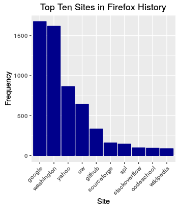

# Databases in R
Brian High  
  


## Learning Objectives

You will learn:

* What databases are supported by R
* How to connect to databases in R
* How to create database tables from R data frames
* How to query databases with SQL
* How to store query results as R data frames

## R's Database Support

R can can connect to many types if databases, either through specific packages
or through the more generic RODBC and RJDBC packages.

Here are some examples of database products you can connect to from R:

* SQLite
* PostgreSQL
* MySQL and MariaDB
* Oracle Database
* Microsoft SQL Server
* Microsoft Access
* IBM DB2
* Google BigQuery
* MongoDB
* Hadoop

## SQLite and PostgreSQL

In this module, we will learn how to use SQLite and PostgreSQL databases.

### SQLite

SQLite is a very popular open-source database providing standard SQL
language support and a file-based implementation. It is easy to install
and to use, but lacks the performance of the server-based database systems.

### PostgreSQL

PostgreSQL is a popular open-source database providing high-end performance
and features. Like SQLite, it also provides standard SQL language support,
but it offers highly-scalable performance and enterprise features. It is
server-based, making it harder to install for the casual user, but easier
to offer in an enterprise (i.e. campus) environment.

## Benefits of a Server-Based Database

A server will be accessible by a team of collaborators so they can share the
database without the need to copy files around.

Users do not run the risk of the database being overwritten by a simple file transfer, as would be the case with a file-based database.

Users can read and write data without completely locking others out of 
the entire database. 

A server-based database does not send the entire database over the network when
it is accessed, just the data that was requested. 

A server will usually be more reliable and have a greater amount of resources
-- processing, memory, and storage -- than your local computer.

A server-based database will use internal query optimizers to make your query
more efficient and run faster.

A server is usually running 24/7 and can process your bigger queries during
off-hours when the system load is lower.

## The SQL Language

Most traditional databases provide access through the standard SQL language. So
if you learn this language, you can work with the vast majority of databases
that you will encounter. Learning SQL is a very smart idea if you plan to 
work with data, especially with large datasets or in a collborative environment.

SQL is designed to be similar in syntax to the English language. Here are some
example commands:

```
CREATE TABLE bmi ("id" INTEGER, "weight" REAL, "height" REAL);
INSERT INTO bmi VALUES (1, 159.2, 68.1);
INSERT INTO bmi VALUES (2, 162.3, 69.4);
INSERT INTO bmi VALUES (3, 203.5, 71.2);
INSERT INTO bmi VALUES (4, 181.3, 68.9);
SELECT "id", "weight", "height" FROM bmi;
SELECT "weight" / ("height" * "height") * 703 AS aBMI FROM bmi;
```

These commands will make a database table, store four records in it, display
the records, calculate a value from the data for each record, and then display 
the results of the calculation.

## Create Test Data

The equivalent to the above SQL commands in R would be:


```r
id <- 1:4
weight <- c(159.2, 162.3, 203.5, 181.3)        # Weight in pounds
height <- c(68.1, 69.4, 71.2, 68.9)            # Height in inches
bmi <- data.frame(id, weight, height, stringsAsFactors = FALSE)
bmi
```

```
##   id weight height
## 1  1  159.2   68.1
## 2  2  162.3   69.4
## 3  3  203.5   71.2
## 4  4  181.3   68.9
```

```r
aBMI <- (bmi$weight / bmi$height ^ 2) * 703    # Adult BMI
aBMI
```

```
## [1] 24.13260 23.68945 28.22018 26.84817
```

## Install SQLite and R Package

To use SQLite with R, you need to install [SQLite](https://www.sqlite.org/) 
on your system and install the `RSQLite` R package.

To install SQLite, get the [binary libraries and tools](https://www.sqlite.org/download.html) 
from the [SQLite](https://www.sqlite.org/) website. Extract the files and
place them in your [system PATH](https://en.wikipedia.org/wiki/PATH_(variable)).

This will allow you to run the `sqlite3` command-line utility and also to
interact with SQLite from programming languages like R.

To test that SQLite is installed okay on your system, run the command 
`sqlite3` from your system's Terminal (e.g. *Bash*, *PowerShell*, etc.).

```
$ sqlite3
SQLite version 3.13.0 2016-05-18 10:57:30
Enter ".help" for usage hints.
Connected to a transient in-memory database.
Use ".open FILENAME" to reopen on a persistent database.
sqlite> .q
```

Once SQLite installation is complete, you can install the `RSQLite` package:


```r
install.packages("RSQLite")
```

## Store Data in SQLite

We will load the *RSQLite* package, create a temporary database file, and
then store our `bmi` data frame into a new SQL table in our SQLite database.


```r
library("RSQLite")
drv <- dbDriver("SQLite")
sqlfile <- tempfile(tmpdir="~", fileext=".sqlite")
sqlfile       # This will show the database filename.
```

```
## [1] "~/file1c4a40a951f3.sqlite"
```

```r
con <- dbConnect(drv, dbname = sqlfile)
rs <- dbWriteTable(con, "bmi", bmi)
```

## Table Structure

We can query the database to see the structure of the table we have created.


```r
query <- "SELECT sql from sqlite_master WHERE type='table' and name = 'bmi';"
cat(dbGetQuery(con, query)$sql)
```

```
## CREATE TABLE bmi 
## ( "id" INTEGER,
## 	"weight" REAL,
## 	"height" REAL 
## )
```

The result shows the SQL command that could be used to recreate the database 
table structure. However, running this command would only create an empty table.

## Table Contents

We can see the contents of the table with:


```r
query <- "SELECT * from bmi;"
bmi.table <- dbGetQuery(con, query)
bmi.table
```

```
##   id weight height
## 1  1  159.2   68.1
## 2  2  162.3   69.4
## 3  3  203.5   71.2
## 4  4  181.3   68.9
```

Here we have retrieved the result of the query and stored it in the data frame 
`bmi.table`. Then we displayed the contents of the data frame.

## Performing a Calculation in SQLite

This is the result of the BMI calculation as performed by SQLite.


```r
query <- 'SELECT "weight" / ("height" * "height") * 703 AS aBMI FROM bmi;'
aBMI.table <- dbGetQuery(con, query)
aBMI.table
```

```
##       aBMI
## 1 24.13260
## 2 23.68945
## 3 28.22018
## 4 26.84817
```

Of course, this calculation is more easily done directly in R. We only see
the benefits of using databases such as SQLite when we have more data that
can fit in our systems memory (RAM).

## Disconnect from the Database

When you are done using the database, you will want to disconnect from it, so
that you will no longer be locking the file.


```r
# Disconnect from the database
dbDisconnect(con)
```

```
## [1] TRUE
```

And, since this was just a temporary database that we no longer need, we will
go ahead and remove the file.


```r
unlink(sqlfile) 
```

Of course, you would not remove the file if you still needed it, so be careful
when using this command.

## SQLite Example: Firefox History

Your Firefox browsing history is stored in a SQLite database, `places.sqlite`.


```r
library(RSQLite)
ffhist <- dbConnect(SQLite(), 'places.sqlite')   # Copy this file from "Profiles"
hits <- dbGetQuery(ffhist, 'SELECT url FROM moz_places WHERE url LIKE "http%"')

library(urltools)
domains <- suffix_extract(domain(hits$url))

library(dplyr)
domains %<>% group_by(domain) %>% summarise(count=n()) %>% arrange(desc(count))
domains$domain <- factor(domains$domain, as.character(domains$domain))

library(ggplot2)
ggplot(head(domains, 10), aes(x=domain, y=count)) +
  geom_bar(stat="identity", colour="darkblue", fill="darkblue") +  
  theme(axis.text.x = element_text(angle = 45, hjust = 1)) + 
  ggtitle("Top Ten Sites in Firefox History") +
  labs(x="Site", y="Frequency")

res <- dbDisconnect(ffhist)
```

## SQLite Example: Firefox History



## PostgreSQL

We will now demonstrate how to use a server-based database system, PostgreSQL.

The same standard SQL language will be used to access data, but there are slight 
differences in the "flavor" of SQL used by PostgreSQL and SQLite. These lead
to minor syntax differences. Also, PostgreSQL has many more features, but we 
only use the basic features in our demonstration.

It is more complicated to install PostgreSQL, so you will likely need help from
your system administrator to set up a working PostgreSQL server. You will also
need a PostgreSQL account on your server, as well as a database to store your 
tables.

We have set up PostgreSQL on a server for your use. If you would like to use it,
let us know so we can create your account and database.

Here is how we would set up your PostgreSQL account and database (from *Bash*):

```
# sudo -u postgres createuser <username>
# sudo -u postgres createdb -O <username> <dbname>
```

... where `<username>` and `<dbname>` would be replaced with actual names.

## US Arrests Dataset

For our PostgreSQL example, we will use the 
[US Arrests](https://stat.ethz.ch/R-manual/R-devel/library/datasets/html/USArrests.html) 
dataset* that comes with R. 


```r
data("USArrests")
str(USArrests)
```

```
## 'data.frame':	50 obs. of  4 variables:
##  $ Murder  : num  13.2 10 8.1 8.8 9 7.9 3.3 5.9 15.4 17.4 ...
##  $ Assault : int  236 263 294 190 276 204 110 238 335 211 ...
##  $ UrbanPop: int  58 48 80 50 91 78 77 72 80 60 ...
##  $ Rape    : num  21.2 44.5 31 19.5 40.6 38.7 11.1 15.8 31.9 25.8 ...
```

`*` McNeil, D. R. (1977) *Interactive Data Analysis*. New York: Wiley. 

## PostgreSQL Connection

We start by loading the `RPostgreSQL` library and connecting to the PostgreSQL 
database.


```r
#install.packages("RPostgreSQL", repos = 'http://cran.r-project.org')
library(RPostgreSQL)

drv <- dbDriver("PostgreSQL")
con <- dbConnect(drv)
```

## Create `private` Schema

In this example, we are using a `private` schema. The word *schema*, as used
in the context of PostgreSQL, means a container for tables within the database.

We could call this schema just about anything, but we will call it `private`
for clarity and simplicity.

If this is the first time you are using your database, you will need to create 
your `private` schema. This is a place for you to work that only you can access.


```r
sql <- 'CREATE SCHEMA private AUTHORIZATION <username>;'
rs <- dbSendQuery(con, sql)
```

... where `<username>` should be repaced by your actual username.

This only needs to be done once.

## Write Table

Now we can write the `USArrests` data frame to a SQL table.


```r
sql <- 'DROP TABLE IF EXISTS private.arrests'
rs <- dbSendQuery(con, sql)
rs <- dbWriteTable(con, c("private", "arrests"), USArrests)
```

If you did not specify the schema ("private"), the connection would default to
the "public" schema, and other users of the database would have access to your
table.

For more information about schemas in PostgreSQL, see the [manual](https://www.postgresql.org/docs/9.5/static/ddl-schemas.html).

## SQL Query

Next, we run this SQL query on our database:

```
SELECT "row.names" AS "State", "Murder", "Assault", 
   ROUND(CAST(100 * "Murder" / "Assault" AS NUMERIC), 1) AS "MurderAssaultRatio" 
FROM private.arrests 
ORDER BY "MurderAssaultRatio" DESC 
LIMIT 10
```

Our query will `SELECT` the top-ten states having the highest ratio of murders 
to assaults, which we will report as a percentage. 

Since the query is executing on the SQL server, not on our local system, the
query will be optimized for speed and will use minimal network bandwidth.

## Running the Query

This is how we run the SQL query from R:


```r
sql <- 
'SELECT "row.names" AS "State", "Murder", "Assault", 
    ROUND(CAST(100 * "Murder" / "Assault" AS NUMERIC), 1) AS "MurderAssaultRatio" 
FROM private.arrests 
ORDER BY "MurderAssaultRatio" DESC 
LIMIT 10'

rs <- dbSendQuery(con, sql)
df <- fetch(rs, n = 10)
df
```

```
##            State Murder Assault MurderAssaultRatio
## 1         Hawaii    5.3      46               11.5
## 2       Kentucky    9.7     109                8.9
## 3        Georgia   17.4     211                8.2
## 4  West Virginia    5.7      81                7.0
## 5      Tennessee   13.2     188                7.0
## 6        Indiana    7.2     113                6.4
## 7          Texas   12.7     201                6.3
## 8      Louisiana   15.4     249                6.2
## 9    Mississippi   16.1     259                6.2
## 10          Ohio    7.3     120                6.1
```

## Using `psql`

While you can access your database from R, sometimes it is easier to 
interact with it from the `psql` command-line utility.

Here is an example of using `psql` from a *Bash* terminal. The Bash 
prompt is shown as `$`. 

```
$ psql "sslmode=require"
psql (9.5.4)
Type "help" for help.
```

## Listing Tables with `\dt`

The `psql` prompt is shown below as `DB=>`, where DB would be replaced 
with your actual database name.

```
DB=>
```

To see tables in the `private` schema, you will need to set your `search_path`.

```
DB=> SET search_path TO private, public;
SET
```

`psql` responds with `SET`. Now you can list the tables (relations) with `\dt`.

```
DB=> \dt
         List of relations
 Schema  |  Name   | Type  | Owner 
---------+---------+-------+-------
 private | arrests | table | <username>
(1 row)
```

... where `<username>` would be replaced with your actual username.

## Using SELECT from `psql`

You can enter SQL queries at the `psql` prompt.

```
DB=> SELECT * FROM private.arrests LIMIT 5;
 row.names  | Murder | Assault | UrbanPop | Rape 
------------+--------+---------+----------+------
 Alabama    |   13.2 |     236 |       58 | 21.2
 Alaska     |     10 |     263 |       48 | 44.5
 Arizona    |    8.1 |     294 |       80 |   31
 Arkansas   |    8.8 |     190 |       50 | 19.5
 California |      9 |     276 |       91 | 40.6
(5 rows)
```

Quit the `psql` session with `\q`.

```
DB=> \q
```

## Accessing PostgreSQL with *dplyr*

What if you don't know SQL and don't have time to learn it?

You can use the *dplyr* package to convert R code into SQL to run on a SQL 
database. SQLite, PostgreSQL, and MySQL are supported by *dplyr*.

*dplyr* is a "data wrangling" package by [Hadley Wickham](http://hadley.nz/).
You can use *dplyr* functions and the mathematical operators and functions of
base R to create SQL queries which extract subsets of data from your database.

We will use *dplyr* with our `arrests` database and base our example on [code](ttps://github.com/rstudio/webinars/tree/master/14-Work-with-big-data) 
from an RStudio [webinar](https://www.rstudio.com/resources/webinars/working-with-big-data-in-r/).

For a detailed example using SQLite, see 
[Working with databases in R](https://www.r-bloggers.com/working-with-databases-in-r/) 
by Fisseha Berhane.

## Accessing `arrests` with *dplyr*

First, we will connect to the database and view the available tables.


```r
suppressMessages(library(dplyr))

dbname <- Sys.info()['user']   # My database is named after my username
db <- src_postgres(dbname = dbname, 
                   options="-c search_path=private")

# List table names
src_tbls(db)
```

```
## [1] "arrests"
```

```r
# Create a table reference with tbl()
arrests <- tbl(db, "arrests")
```

## Accessing `arrests` with *dplyr*

Next, we will create a SQL query from some *dplyr* functions.


```r
# Manipulate the reference as if it were the actual table
extract <- select(arrests, State=row.names, Murder, Assault) %>% 
           mutate(MurderAssaultRatio=100*Murder/Assault) %>%
           arrange(desc(MurderAssaultRatio)) %>% head(10)

# Show the SQL command that dplyr will run
show_query(extract)
```

The SQL looks complicated from the use of nested `SELECT` statements, but it work.

## Accessing `arrests` with *dplyr*

Run the query and view the structure of the results.


```r
# Save the result of this query as a local data structure with collect()
extracted <- extract %>% collect()
str(extracted)      # A tbl_df, based on a data frame
```

```
## Classes 'tbl_df', 'tbl' and 'data.frame':	10 obs. of  4 variables:
##  $ State             : chr  "Hawaii" "Kentucky" "Georgia" "West Virginia" ...
##  $ Murder            : num  5.3 9.7 17.4 5.7 13.2 7.2 12.7 16.1 15.4 7.3
##  $ Assault           : int  46 109 211 81 188 113 201 259 249 120
##  $ MurderAssaultRatio: num  11.52 8.9 8.25 7.04 7.02 ...
```

## Accessing `arrests` with *dplyr*

Finally, display the results. We see that the object is now called a 
[tibble](https://blog.rstudio.org/2016/03/24/tibble-1-0-0/) (tbl_df).


```r
extracted
```

```
## # A tibble: 10 × 4
##            State Murder Assault MurderAssaultRatio
## *          <chr>  <dbl>   <int>              <dbl>
## 1         Hawaii    5.3      46          11.521739
## 2       Kentucky    9.7     109           8.899083
## 3        Georgia   17.4     211           8.246445
## 4  West Virginia    5.7      81           7.037037
## 5      Tennessee   13.2     188           7.021277
## 6        Indiana    7.2     113           6.371681
## 7          Texas   12.7     201           6.318408
## 8    Mississippi   16.1     259           6.216216
## 9      Louisiana   15.4     249           6.184739
## 10          Ohio    7.3     120           6.083333
```

## Other Databases

R can connect to many types of SQL and other types if databases.

For examples of using other databases from R, such as MySQL, see 
our [Data Workshop](https://github.com/brianhigh/data-workshop/wiki/Embedded-SQL) 
wiki page.

## Excercises

To gain some more practice with databases and R, you are encouraged to try these
exercises. You may complete the exercises using SQL or *dplyr* queries.

DEOHS account holders may use the server `plasmid` for these two exercises, 
as it has SQLite and PostgreSQL installed on it. This server runs Linux and 
can only be directly a ccessed from campus. The *Bash* shell can be accessed 
through an SSH session. R can be accessed through RStudio Server running in 
your web browser.

* Bash (via SSH): plasmid.deohs.washington.edu
* RStudio: https://plasmid.deohs.washington.edu

Exercise #1:

Create the `arrests` table in SQLite and query it as described in our PostgreSQL
example. Extra credit: Run the top-ten ranking query from the `sqlite3` command-line utility. 

Exercise #2:

Create the `bmi` table in PostgreSQL and query it as described in our SQLite
example. Extra credit: Run the calculation query from the `psql` command-line utility.
