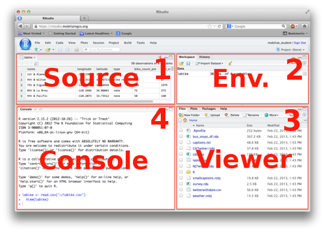
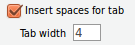
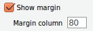

```{r set_knitr_options, echo=FALSE, message=FALSE, warning=FALSE}
suppressMessages(library(knitr))
opts_chunk$set(tidy=FALSE, cache=TRUE, echo=TRUE, message=FALSE)
```

## Learning Objectives

You will learn:

* What RStudio is and isn't
* Reasons to use RStudio
* How to get RStudio
    - Download from Internet (free)
    - Use on departmental server through web browser (free)
* How to install RStudio onto your local computer
* How to use RStudio
    - Orientation to screen layout, panes, tabs, menus, and buttons
    - Customization and Global options
    - File management

## What RStudio is and isn't

### RStudio is:

* A full-featured, cross-platform, open source application for working with R
    - providing a graphical user interface (GUI)
        + and an integrated development environment (IDE)
    - with both desktop and server editions
        + that look and function almost exactly alike
        + with both free and non-free editions
* Created by a commercial organization also called "RStudio"

### RStudio isn't:

* A point-and-click GUI application like a spreadsheet program
* A text-only command-line utility
* An R language interpreter

## Why use RStudio?

* It is a user-friendly way to use R
    - The interface feels familiar to many people (similar to other IDEs)
    - It integrates operations common to many data analysis workflows
* You can use it for free on most computer systems
* It is very popular, so your collaborators may already be using it
* Very few alternatives (R-GUI, JGR, Visual Studio) are as full-featured
* It performs well, is designed well, and is backed by a respected company

Of course, feel free to use any R application that works best for you. Some
people even prefer the standard R console that comes with R. (It's simpler.)

## How to get RStudio

### Download for free from the Internet

* [https://www.rstudio.com/products/rstudio/download/](https://www.rstudio.com/products/rstudio/download/)

### Use on departmental servers through your web browser

* [Phage](https://phage.deohs.washington.edu)
    - Requires UW NetID and special group membership
    - Access world-wide
    - Easily access your "U Drive"
* [Plasmid](https://phage.deohs.washington.edu)
    - Requires UW NetID and DEOHS account
    - UW Campus only (or through "VPN", etc.)
    - Easily access your departmental storage (network "drives")
    
These are free to use by those with DEOHS affiliation UW NetIDs. All you need
to use them is a web browser and an account. They are maintained by DEOHS EHIT.

## How to install R and RStudio Desktop

If you are using RStudio Server, you can skip this step. You can also skip this
step if RStudio Desktop is already installed on your computer.

To install R and RStudio Desktop:

1. [Download](https://cran.r-project.org/banner.shtml) the latest
   **_installer_** version of **_R_** available for your operating system.
     - Run the installer (usually by double-clicking on the installer's icon).
     - Click through the installer's prompts accordingly. The defaults are       
       usually fine.
2. [Download](https://www.rstudio.com/products/rstudio/download/) the latest
   **_installer_** version of **_RStudio Desktop_** available for your 
   operating system.
     - Run the installer (usually by double-clicking on the installer's icon).
     - Click through the installer's prompts accordingly. The defaults are       
       usually fine.
3. You may remove the installers when you have confirmed that RStudio is 
   installed correctly and launches without error.

## Up Next: How to use RStudio

* Orientation to:
    - screen layout
        + panes
        + tabs
        + menus
        + buttons
* Customization and Global options
* File management
    
## Orientation: Default Pane Locations

1. If there is a file open, it will appear in the upper-left ("Source") pane
2. The session information will be found in the upper-right ("Environment") pane
3. The "Viewer" pane with tabs for files, Plots, Help, etc. is in the 
   lower-right
4. The interactive R prompt ("Console") will appear in the left or lower-left pane



## Orientation: Source Pane

The "Source" pane is where files will display when opened and where data grids
will display.

The reason it is called the "Source" pane is because it is primarily used to
edit source code such as R scripts as text files. 

When text files are opened in RStudio, the tab they are displayed in is a 
full-featured text editor with syntax highlighting, search-and-replace and
many other features.
* You can select highlighting for many programming languages in a pick list.
* Editor and other options may be set under Tools -> Global Options.

## Orientation: Environment Pane

The "Environment" pane contains tabs for the "Environment" variables, the 
command "History", and other content related to your current session or Project.

The "Environment" variables are those data objects which are currently loaded
into memory. 

* A little bit of information about their structure and contents will be 
  displayed here. 
* You can click an item to view it in the "Source" pane, often as a grid.

The "History" tab is for your command history. You can send commands from 
your history to your Console tab in the Console pane or to the selected editor 
tab in the Source pane.

The "Git" tab will only show when you are working with a Project managed by
the Git version control system. (More on this later.)

## Orientation: Viewer Pane

The "Viewer" pane is where you can view and manipulate:

* Files
* Plots
* Packages
* Help
* Additional web content ("Viewer" tab)

There is a tab for each of these.

## Orientation: Console Pane

The Console is where you can type (or paste) commands at an interactive R 
prompt.

The prompt will be found at the bottom of the Console tab of the Console pane.

Code selected from the text editor in the Source pane or from the command 
history in the Environment pane can also be run here.

There may be other tabs for additional program output in the Console pane. 

For example, output from pressing the "Knit HTML" button will appear in a 
"R Markdown" tab in the Console pane.

## Orientation: Panes and Tabs

Each pane has two grey buttons in the upper left which allow you to minimize or
maximize the pane. Maximizing just increases the height, not the width.

Each pane has one or more tabs which allow you to pick what you view in that
pane.

Some tabs have a grey "X" in the upper left corner of that tab that let's you
close the tab.

Some tabs offer a menu of buttons with text labels beneath the tab. These allow
you to perform operations related to the contents of the tab. Some of the buttons are pick-lists.

The "Files" tab offers a "breadcrumb" navigation feature under the row of buttons.

## Orientation: Menus and Buttons

The top-level application menus will have the same choices regardless of
which pane you are using. 

Some choices will be "greyed out" if they are not available for a particular 
operation.

The menus, buttons, and pick-lists in the panes will vary depending on the
content of the pane and the context of the operation you are performing.

There is a button with an icon of a broom (or brush). The text associated
with this button is "Clear" or "Clear All". You can use it to clear the 
contents of the tab.

Some tabs offer a Search box with a magnifying glass icon. Tabs with this
feature include the Environment, Files, Packages, and Help tabs.

## Customization and Global Options

You can customize many aspects of RStudio with the Tools -> Global Options
menu choice.

This opens a configuration settings window with navigation on the side.

Here are some recommended settings:

* Code -> (Editing) -> [x] Insert spaces for tab, Tab width 4
    - 
* Code -> (Display) -> [x] Show margin, Margin column 80
    - 

These settings will help you write more readable code. (More on this later.)

You may also wish to customize your pane layout in "Pane Layout".

## File Management

The Files tab of the Viewer pane is useful for file navigation and management.

You can navitate to your files and move, copy, rename, and delete them. You can
create new folders. 

In RStudio Server you can also upload and download files using this tab.

## 

```{r child = '../questions.html'}
```