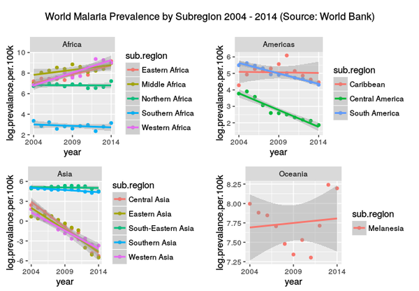

# Literate Programming with R and RStudio
Brian High  
  

## Learning Objectives

You will learn:

* What literate programming is
* Why literate programming matters
* What tools are available for literate programming
* How to use R and RStudio for literate programming
* What kinds of documents R Markdown supports
* The basics of formatting documents with R Markdown
* The basics of using *knitr* to render R Markdown documents
* How to share or publish R Markdown and rendered documents

## Literate Programming

Literate Programming is:

* Interspersing explanatory text with code
    - to make a report that is executable
        - to automate report production

## Reproducibility 

For the purpose of this discussion, let's define:

* **_Replicate_**: to repeat a study (with new samples and data)
* **_Preproduce_**: to regenerate the results of an analysis (with the same data)

Our studies may be difficult to fully *replicate* ... but our analysis should always be *reproducible*.

Or in other words:

We should always be able to go from raw data to final results at any time ...
*and always get the same results* from the same data and the same analysis*.

`*` Even if you are doing modeling with randomly-generated values, you can set
the *seed* to produce the same values each time you run the analysis.

## Literate Programming

In the light of reproducibility, Literate Programming is:

* Interspersing explanatory text with code
    - to make a report that is executable
        - to automate report production
            - and to improve reproducibility
                - by allowing the recipient to re-render the report
                    - to verify the results (plots and figures)
                        - are produced from the embedded code

## Literate Programming Tools

There are two main platforms for literate programming:

* **_Python_**: Jupyter Notebook
* **_R_**: R Markdown and *knitr*

Both platforms can be used with other programming languages or a mix of them.

## Jupyter Notebook

Jupyter Notebook runs in a web browser and embeds results as you type
commands. We will not be using Jupyter Notebook in today's module.

](images/jupyternotebook.png)

## R Markdown and *knitr*

To use R Markdown and *knitr* for Literate Programming, all you need is a text
editor, R, and a few packages such as *knitr*.

* R Markdown: The text notation you use for formatting, based on Markdown
* *knitr*: A package by Yihui Xie used to render R Markdown documents

](images/storms-004.png)

These tools are well integrated into RStudio.

## R Markdown Syntax

[R Markdown](http://R Markdown.rstudio.com/) is a "wiki" syntax based on 
[Markdown](https://daringfireball.net/projects/markdown/). Here is an 
example:

## R Markdown Cheatsheet

](images/cheatsheet.png)

## *knitr*

The R package which renders the R Markdown document is *knitr*. It uses other 
packages and utilities as needed to produce different document formats.

In RStudio, you would nomally run *knitr* using the *Knit HTML* button. 

If your document has been configured in R Markdown to generate a PDF document,
the the button will show as *Knit PDF*.

So, the appearance of the button changes depending on the document type.

You can also the *File* -> *Knit Document* or *File* -> *Compile Notebook*
menu options.

## Sharing and Publishing

You can share your R Markdown source document, along with any data, images,
and other related files on an online repository, such as GitHub.

](images/bootcamp_github.png)

## Sharing and Publishing

You may also use the *Publish* button or *File* -> *Publish...* menu
choice. This will send the rendered document to the RPubs website, run by RStudio.

](images/ndbc_rpubs.png)

## Example: Weather Data Plot

Given this script: [ndbc_plot.R](ndbc_plot.R), convert to R Markdown and render in
various formats (HTML, PDF, Markdown, and MS-Word). Is this "reproducible"? Why 
or why not?

One version of this script, as rendered from R Markdown, is published on 
[RPubs](https://rpubs.com/brianhigh/108765).

## Exercise #1: Zika Cases US Map

Convert [zika.R](zika.R) (most recent CDC data) or [zika.R](https://github.com/brianhigh/computing_bootcamp/blob/e88a55c4be0b4dc469cc1f3f7f688f03f1a7c35b/R/zika.R) (CDC data as of 2016-08-31) to R Markdown and render as HTML and PDF. Which is more
"reproducible"?

## Exercise #2: World Malaria Prevalence

Convert [malaria.R](malaria.R) to R Markdown and render as HTML and PDF. You may 
choose to use only a few sections of the analysis (like "prevalence by subregion") 
to save time.

## 

<pre style="color: indigo; background: linear-gradient(to right, gold, rgba(255,0,0,0)); padding-top: 50px; padding-bottom: 50px;">
                                                                                        
                                                  ,,                                    
  .g8""8q.                                 mm     db                           ,M"""b.  
.dP'    `YM.                               MM                                  89'  `Mg 
dM'      `MM `7MM  `7MM  .gP"Ya  ,pP"Ybd mmMMmm `7MM  ,pW"Wq.`7MMpMMMb.  ,pP"Ybd    ,M9 
MM        MM   MM    MM ,M'   Yb 8I   `"   MM     MM 6W'   `Wb MM    MM  8I   `" mMMY'  
MM.      ,MP   MM    MM 8M"""""" `YMMMa.   MM     MM 8M     M8 MM    MM  `YMMMa. MM     
`Mb.    ,dP'   MM    MM YM.    , L.   I8   MM     MM YA.   ,A9 MM    MM  L.   I8 ,,     
  `"bmmd"'     `Mbod"YML.`Mbmmd' M9mmmP'   `Mbmo.JMML.`Ybmd9'.JMML  JMML.M9mmmP' db     
      MMb                                                                               
       `bood'
</pre>
<!-- http://patorjk.com/software/taag/#p=display&f=Georgia11&t=Questions%3F%0A -->
