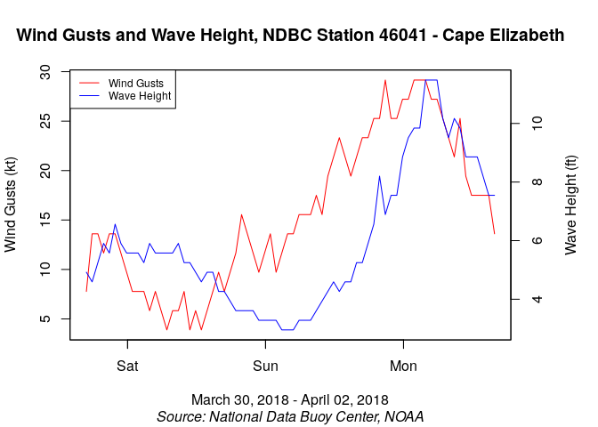

## Clear Workspace


```r
# Clear the workspace, unless you are running in knitr context
if (!isTRUE(getOption('knitr.in.progress'))) {
    closeAllConnections()
    rm(list = ls())
}
```

## Configure Settings

Configure settings for the rendering of this document.


```r
suppressMessages(library(knitr))
opts_chunk$set(tidy=FALSE, cache=FALSE, echo=TRUE, message=FALSE)
```

Configure the NDBC Station ID, Station Name, local timezone and number of days 
of weather observations to plot. 


```r
stn.id    <- '46041'            # ID List: http://www.ndbc.noaa.gov/to_station.shtml
stn.name  <- 'Cape Elizabeth'   # https://www.google.com/search?q=ndbc+neah+bay
tz.string <- "US/Pacific"       # Convert NDBC date/times from UTC to this timezone
days      <- 3                  # Number of days to plot
```

## Retrieve NDBC Data

Download the text data file for NOAA NDBC Station ID 46041 (Cape Elizabeth).


```r
cols <- c("YY", "MM", "DD", "hh", "mm", "WDIR", "WSPD", "GST", "WVHT", "DPD", 
          "APD", "MWD", "PRES", "ATMP", "WTMP", "DEWP", "VIS", "PTDY", "TIDE")
site <- "http://www.ndbc.noaa.gov/data/realtime2/"
ndbc <- read.fwf(
    file=url(paste(site, stn.id, ".txt", sep="")), col.names=cols, skip=2,
    widths=c(4, 3, 3, 3, 3, 4, 5, 5, 6, 6, 6, 4, 7, 6, 6, 6, 5, 5, 6), 
    na.strings=c("MM"), stringsAsFactors=FALSE, strip.white=TRUE)
```

## Calculate Date Range and Subset Data

Convert dates to POSIX date format and select only last 3 days of wind 
gusts and wave height.


```r
# Determine start and end dates and convert dates to strings for use in plot
end.date <- as.POSIXct(Sys.time(), tz=tz.string)
start.date <- end.date - as.difftime(days, units = "days")
end.date.string <- format(end.date, format="%B %d, %Y")
start.date.string <- format(start.date, format="%B %d, %Y")

# Convert date components of raw data to a date-time format for calculations
ndbc$DATE <- as.POSIXct(paste(ndbc$YY, ndbc$MM, ndbc$DD, ndbc$hh, ndbc$mm, 
                              sep="."), format = "%Y.%m.%d.%H.%M", tz="UTC")
attr(ndbc$DATE, "tzone") <- tz.string
ndbcww <- na.exclude(ndbc[ndbc$DATE > start.date, c("DATE", "WVHT", "GST")])
```

## Plot Wind Gusts and Wave Height

Plot wind gusts and wave height by date using base R graphics.


```r
par(mar=c(5, 4, 4, 5) + .1)
# Plot wind gusts with conversion from meters per second (m/s) to kt
plot(ndbcww$DATE, ndbcww$GST*1.943844, 
     type="l", col="red", ylab="Wind Gusts (kt)", xlab="")
par(new=T)
# Plot wave height, with conversion from meters (m) to feet (ft)
plot(ndbcww$DATE, ndbcww$WVHT*3.28084, 
     type="l", col="blue", xaxt="n", yaxt="n", xlab="", ylab="")
axis(4)
mtext("Wave Height (ft)", side=4, line=3)
title(main=paste("Wind Gusts and Wave Height, NDBC Station", 
                 stn.id, "-", stn.name))
legend("topleft", legend=c("Wind Gusts", "Wave Height"), 
       col=c("red", "blue"), lty=1, cex=0.75)
mtext(paste(start.date.string, '-', end.date.string), side = 1, line = 3)
mtext("Source: National Data Buoy Center, NOAA", font=3, side = 1, line = 4)
```

<!-- -->


## Data Sources

Plot data are from [U.S. Dept. of Commerce](https://www.commerce.gov/) 
[National Oceanic and Atmospheric Administration](http://www.noaa.gov/) (NOAA) 
[National Weather Service](http://www.weather.gov/) (NWS) 
[National Data Buoy Center](http://www.ndbc.noaa.gov/) (NDBC).

## License

The RMarkdown source document and all rendered reports generated from it are 
licensed under the [Creative Commons CC0 1.0 Universal Public Domain Dedication](https://creativecommons.org/publicdomain/zero/1.0/).
