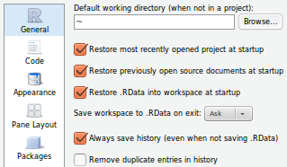

```{r set_knitr_options, echo=FALSE, message=FALSE}
suppressMessages(library(knitr))
opts_chunk$set(tidy=FALSE, cache=TRUE, echo=TRUE, message=FALSE)
```

## Learning Objectives

You will learn:

* What an R "session" is
* How to save your session
* How to load a saved session
* How a session is stored
* How to read and write data files
* How to edit, save, and run scripts


## R Sessions and Profiles

An R session is an instance of R running for a certain amount of time in a certain context.

An R session:
 
* has a working environment (i.e., the "context")
    - with settings, data, and command history (collectively called the **_profile_**)
* starts by loading a *profile*
    - created for you with defaults if no custom *profile* found
* has a collection of open data objects, called the **_workspace_**
    - can be cleared (in RStudio: Session -> Clear Workspace...)

To start R from the command-line with no profile: 

```{r, engine='bash', eval=FALSE}
R --no-init-file --no-restore-history
```

## Saving and Loading R Sessions

How do you save an R session?

* answer 'yes' when prompted, upon quitting your session
* save your command history and workspace with R commands or menu choices

Example: Save your command history to the current folder (as `Rhistory`):

```{r, eval=FALSE}
savehistory()
```

Example: Save the workspace (data objects) to the current folder (as `.RData`):

```{r, eval=FALSE}
save.image()
```

In RStudio, you have the menu choices: 

* Session -> Save Workspace
* Session -> Load Workspace As...

## R Working Directory

The "Working Directory" ...

* is the folder that R is currently using
    -  to read and save files (unless otherwise specified)
* can be changed at any time with `setwd()`
* can be checked any time with `getwd()`
* starts as the folder that R was started from if run from the command-line
* starts as the user home folder or the top-level of a "project" (e.g., with RStudio)

## R Session Files

The default files for your history (`.Rhistory`) and workspace (`.Rdata`) are stored:

* **_Command-line_**: in the current working directory
    - at the time you save (or exit your session)
* **_RStudio_**: in your home directory (`~`, H:\, etc.)
* **_RStudio_**: in the top level folder of your R project, if you are working in a project
* **_RStudio_**: locations and behaviors are in Tools -> Global Options... -> General



## R Data Files

The default data file format "native" to R is RData (rda).

Files saved in the format will usually have a name ending with `.RData` or `.rda`.

This is a "binary" (opaque) file format -- it is not to be opened with a text editor.

You can save and load data objects to and from RData files like this:

```{r, eval=FALSE}
x <- 1
y <- "a"
save(x, y, file = "xy.RData")
load("xy.RData")
```

## R Data Files

It is generally a good idea to write data to a standard, "transparent" (i.e., plain text) format
unless you have a good reason to do otherwise.

Writing to a CSV file (two variations):

```{r, eval=FALSE}
data("iris")      # Get a dataset to work with
write.csv(iris, "iris.csv")
write.csv(iris, "iris.csv", row.names = FALSE)
```

Reading from a CSV file (two variations):

```{r, eval=FALSE}
myiris <- read.csv("iris.csv")
myiris <- read.csv("iris.csv", stringsAsFactors = FALSE)
```

There are many other kinds of file formats and R can work with many of them. See:

* [Quick-R: Importing Data](http://www.statmethods.net/input/importingdata.html)
* [R-Tutor: Data Import](http://www.r-tutor.com/r-introduction/data-frame/data-import)

## R Scripts

In addition to your history file, you can also save your commands into files called "scripts".

* Scripts are "plain text" files.
* Scripts are edited in a (programmer's) text editor (**_not_** MS-Word).
* Scripts are also called "programs".
* A person who writes a script is a "programmer".
* Anyone can be a programmer.
* Scripts store a list of commands to be run as a batch.
* It is smart to store your commands in scripts.
* It is smart to make a habit of running your code from scripts instead of the prompt.
* You can use a script many times to automate your work and save time and effort.
* Scripting your analysis makes your work more reproducible, which is very important.
* You can share your code as a script so others can verify your work.

## Running R Scripts

You can run code from an R script by:

* selecting some of the code and running just that code
* running a single line (or block) of code
* saving the file and running ("sourcing") the whole file
* saving and rendering your script with a tool like *knitr* to make a report

The latter approach will bundle the code with the ouput as a single report (PDF, HTML, etc.).

## 

```{r child = '../questions.html'}
```