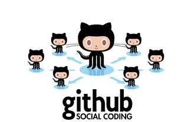
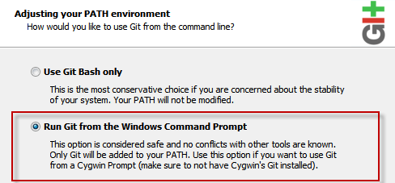
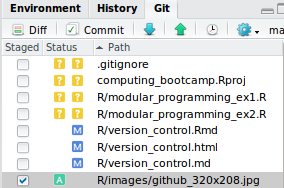

```{r set_knitr_options, echo=FALSE, message=FALSE}
suppressMessages(library(knitr))
opts_chunk$set(tidy=FALSE, cache=FALSE, echo=TRUE, message=FALSE)
```

## Learning Objectives

You will learn:

* What version control is and _why you should care_
* The basic operations of the _Git_ version control system
* How to use [Git](https://git-scm.com/) and [GitHub](https://github.com/) to _manage projects_
* How to use Git and GitHub _from within RStudio_

## Version Control

The following is true of most modern version control systems:

* A method for _tracking changes_ to one or more _files_
* Like Apple Time Machine with "Track Changes" of MS-Word
* Makes changes to one or more files as a _single_ "commit"
* Works with _any type of file_, especially plain-text and "code"
* Allows _multiple users_ to work with the same files _concurrently_
* May also be called: _revision control systems_

](images/version-control-fig1.png)

## Version Control Features

Most modern version control systems:

* Provide _logging_ and _status reports_ for ease of tracking
* Allow you to _compare_ versions or _revert_ to past versions
* Let you _share_ files and _merge changes_ from others
* Handle merging for you, _transparently_ (in most cases)
* Let you _collaborate_ through a _server_ or website like [GitHub](https://github.com/)
* _Sync_ changes with the server instead of ~~emailing files around~~

](images/version-control-fig2.png)

## Git: Distributed Version Control

* Hugely popular, free, open source, and cross-platform
* _Distributed_, decentralized design allows offline use
* _Integrated_ with apps like _RStudio_ and MS Visual Studio _Code_
* The version control "engine" behind sites like [GitHub](https://github.com/)
* Increasingly popular for _scientific research projects_

](images/version-control-fig3.png)

## GitHub: Social Coding

* The most popular web-based ([github.com](http://github.com)) host of Git repositories
* Free account for public repositories
* Accounts for educational use ([education.github.com](http://education.github.com) and [classroom.github.com](http://classroom.github.com))
* Repository browser with syntax highlighting and text editing
* Integrated issue tracking, stats, and wiki
* Offers "forking" and "pull requests" for collaboration workflow
* Hosts GitHub Pages ([github.io](http://github.io)) and GitHub Gists ([gist.github.com](http://gist.github.com))
* Provides GitHub Desktop ([desktop.github.com](http://desktop.github.com)) and GitHub Atom editor ([atom.io](http://atom.io))



## Installing Git

* Installers available from: [https://git-scm.com/](https://git-scm.com/)
* For Windows installer, _allow changes to the system PATH_
* RStudio searches PATH to find "git", or manually configure
* Git is _already installed_ on most of our departmental servers
* [Git for Windows](https://git-for-windows.github.io/) provides a *Bash* shell
* [GitHub Desktop](https://desktop.github.com/) is optional



## Configuring Git

* You need to [configure](https://git-scm.com/book/en/v2/Getting-Started-First-Time-Git-Setup) 
your username and email address.
* Configuring for default editor and color support is nice, too.
* Run these commands from the "shell" (Bash, DOS, etc.).

```
git config --global user.name "John Doe"
git config --global user.email johndoe@example.com
git config --global color.ui true
git config --global core.editor nano         # Or your favorite text editor
git config --global credential.helper cache  # Optional: cache password for 15 min. 
```

Edit these commands as needed for your name, email, and preferred editor. 

If you store them in a shell script, you may easily run them on other systems 
you may be using. (Or you can just copy, paste, edit and run these commands.)

## Git Integration in RStudio

* RStudio can import (`clone`) a git project from a server
* RStudio can perform all _common_ operations from the GUI
    + From the menu: _Tools_ -> _Version Control_
    + From the _Git_ tab next to the _History_ tab



NOTE:

GitHub features like forking and pull requests are not currently implemented 
in RStudio's Git features.

## Demo: GitHub Operations

We will demonstrate the following operations in GitHub:

* Create a GitHub account
* [Fork a repository](https://help.github.com/articles/fork-a-repo/)
* [Create a new repository](https://help.github.com/articles/create-a-repo/) with a README and [LICENSE](https://help.github.com/articles/open-source-licensing/)
* Create an Issue
* Edit a file
* [Close an Issue with a Commit](https://help.github.com/articles/closing-issues-via-commit-messages/)

## Demo: Git Operations in RStudio

We will demonstrate the following [Git operations in RStudio](https://support.rstudio.com/hc/en-us/articles/200532077-Version-Control-with-Git-and-SVN):

* Clone a Git repository into a new RStudio Project
* Create and edit files in RStudio
* Add changed files to a Git commit
* Commit the changes with a Git commit message
* Push the commit to GitHub

## Common Git Operations

| Command  | What it does
|----------|----------------------------------------------
| `clone`  | Copy a repository into a new folder
| `pull`   | Fetch and integrate changes
| `commit` | Record changes to the repository
| `push`   | Send changes to remote repository (server)
| `diff`   | Show changes between commits
| `log`    | Show commit logs
| `status` | Show the current status of files and changes

## Git and GitHub Glossary

- **Repository (repo):** A repository is the most basic element of GitHub. They're easiest to imagine as a project's folder.
- **Branch:** A parallel version of a repository
- **Clone:** Local copy of the repository
- **Commit:** An individual change to a file (or set of files). Commits usually contain a commit message. 
- **Fork:** A personal copy of another user's repository that lives on your account
- **Merge:** Merging takes the changes from one branch (in the same repository or from a fork), and applies them into another.
- **Pull:** Pull refers to when you are fetching in changes and merging them.
- **Pull Request:** Pull requests are proposed changes to a repository submitted by a user and accepted or rejected by a repository's collaborators
- **Push:** Pushing refers to sending your committed changes to a remote repository such as GitHub.com
- **Issue:** A GitHub feature/bug tracking "ticket" (and disucssion thread)
- **Close:** To complete a GitHub Issue or Pull Request workflow

[More details here](https://help.github.com/articles/github-glossary/)

*Thanks to Raphael Gottardo for this slide from his Biostat-578
 [lecture](https://github.com/raphg/Biostat-578/blob/1352ca32c7f12ec8b43f8898cce5cae3831e7a43/Introduction_to_R.Rmd).*
 
## Typical Git and GitHub Workflow

### Project initialization

1. Create a new, empty repo in GitHub
2. `clone` to local system or `push` from existing local repo to GitHub
3. Create `README`, `LICENSE`, and `.gitignore` files, then `push`/`pull` to sync

### Project continuation

1. Add collaborators to GitHub repo if needed
2. Always do a `pull` when you begin a work session and before a `commit`
3. To `commit` changes, `add` changed files, `commit` with a message, and `push`
4. Check your GitHub Issues" and resolve/close issues as separate commits
5. Check your GitHub Pull Requests, review the code, merge (or not), and close

## Exercises

### Exercise #1

Clone a git repo into RStudio as a new project.

### Exercise #2

Create a GitHub account (if you need to) and use your account to [fork a repo](https://help.github.com/articles/fork-a-repo/).

### Exercise #3

Clone your fork from exercise #3 into RStudio, make an edit, push your edit to GitHub.

### Exercise #4 (Extra Credit)

Complete exercises #2 and #3 and then [create a pull request](https://help.github.com/articles/creating-a-pull-request/).