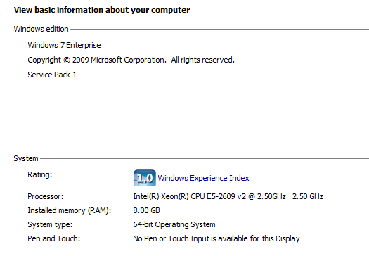
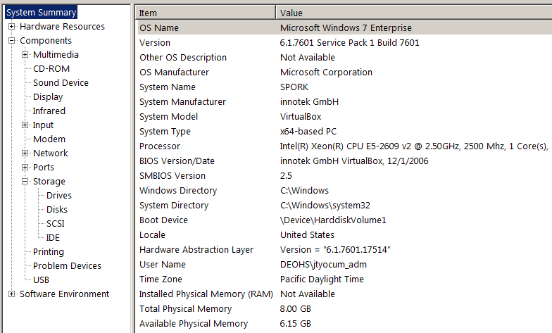

```{r set_knitr_options, echo=FALSE, message=FALSE}
suppressMessages(library(knitr))
opts_chunk$set(tidy=FALSE, cache=FALSE, echo=TRUE, message=FALSE)
```

## Where to find them?

- System Properties (CPU and Memory)
- System Information (CPU, Memory, and Storage)
- Windows Explorer (Storage)

## System Properties



## System Information



## Windows Explorer


## Can you compare CPUs?

- Generation
    - Newer is faster when all else equal
- Clock Speed
    - More is better if core count is the same
- Core Count
    - More is better if clock speed stays the same
    
## How do you compare storage?

- Local Storage (Internal Drives)
    - Typically "fastest"
    - Moderately difficult to upgade
- Portable Storage (USB stick or hard drive)
    - Performance varies wildly
    - Easy to upgrade, just add another
    - Somewhat fragile (tend to fail without warning)
- Network Storage
    - Performance depends on network connection
    - Easy to upgrade (just put in a ticket)
    - Reliable

## How do you compare RAM?

- RAM comes in different speeds and types
    - DDR3, DDR4
    - ECC, and non-ECC
    - Density differences (more memory per chip)
- Performance difference between types is minimal (in most applications)
- ECC (Error Correcting) is only a necessity on a server

## Questions?