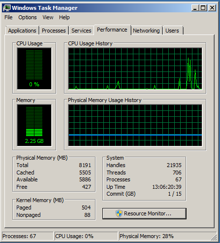
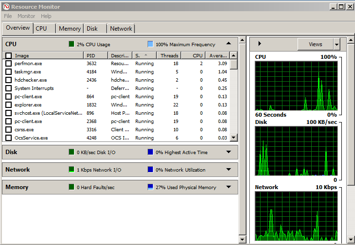

```{r set_knitr_options, echo=FALSE, message=FALSE}
suppressMessages(library(knitr))
opts_chunk$set(tidy=FALSE, cache=FALSE, echo=TRUE, message=FALSE)
```

## Tools

**Windows**

- Task Manager
    - Real time display of CPU, and Memory usage
    - Display usage by process or application
- Resource Monitor
    - More detailed display of resource utilization

## Task Manager



## Resource Monitor



## Better Hardware

- Solid State Drive (SSD)
    - Lower latency
    - Higher throughput
- Increased number of CPU Cores
    - More cores at the same clock speed (or higher)
- Faster CPU Clock Speed
    - Higher clock speed with same number of cores (or more)

## Change the Environment

- Laptop to Desktop
    - Desktops tend to have faster CPUs
    - Are typically equipped with more RAM
- Desktop to Server
    - Servers have more CPUs
    - Capable of having a lot more RAM
- Different operating system
    - Your application may be better optimized on a different operating system
    
## Questions?