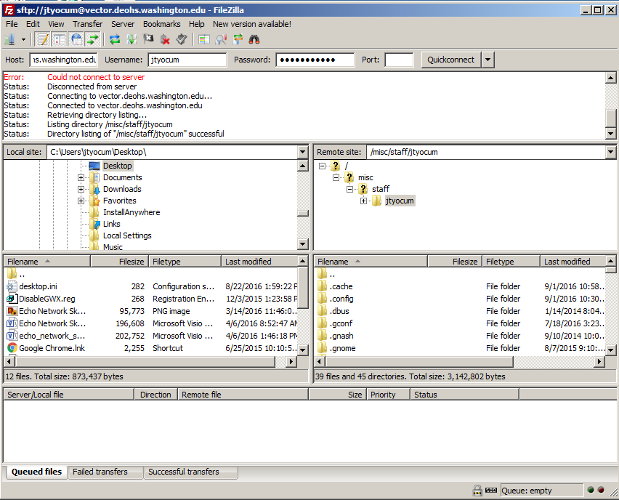

# Accessing Storage
John Yocum  
  

# Software

## FileZilla

- Secure
    - Uses SFTP or SCP (based on SSH)
- Free (and Open Source)
- Works both ON and OFF campus
- Cross platform
    - Windows
    - Mac
    - Linux

## FileZilla

## Alternatives

- WinSCP
    - SFTP
    - Windows only
- CyberDuck
    - SFTP
    - Windows and Mac
- Remote Desktop
    - Windows, Mac, and Linux
- X2Go
    - Windows, Mac, and Linux

# Connecting via Vector

## Connecting with Filezilla

**Off Campus**

1. Get whitelisted by visiting the DEOHS Portal
2. Launch FileZilla 
3. Connect to vector.deohs.washington.edu using SFTP
4. Accept host key, if prompted

**On Campus**

1. Launch FileZilla 
2. Connect to vector.deohs.washington.edu using SFTP
4. Accept host key, if prompted

## Locating Files

**H: Drive or My Documents**

- By default you'll be placed in your H drive
- Your "My Documents" folder will be listed within the contents

**Project or Shared Folders**

- Not all projects are directly visible by SFTP
- Navigate to the path /misc/PROJECT

# Thoughts and Questions

## Thoughts

- For pure file transfers, SFTP via vector is secure and reliable
- With large files, it's better to edit them remotely via Remote Desktop or X2Go
- Remote Desktop offers better data security, by leaving the files securely on the server

## Questions?
