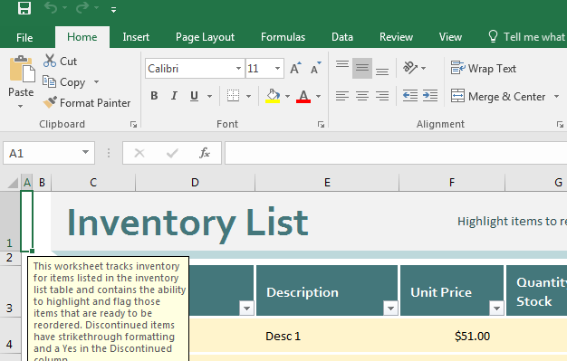

```{r set_knitr_options, echo=FALSE, message=FALSE}
suppressMessages(library(knitr))
opts_chunk$set(tidy=FALSE, cache=FALSE, echo=TRUE, message=FALSE)
```

# Graphical User Interface

## Example Applications

- Word
- Firefox
- Excel



## Pros and Cons

**Pros**

- Easier for most people to learn
- Better for interactive tasks, like web browsing

**Cons**

- Typically difficult to automate tasks
- More complicated documentation process (video works best)
- Greater overhead when working via remote desktop

# Command Line Interface

## Example Applications

- R
- Python
- Wget


## Pros and Cons

**Pros**

- Much easier to automate compared to most graphical tools
- Work great over remote desktop
- Easy to document, just copy and paste commands with notes

**Cons**

- Steeper learning curve
- Typically more difficult to "discover" commands and features

## The Pipeline

- Chain the output from one application to another application's input
- Many utilities can be chained to form a long pipeline
- Information is passed in memory, not via disk

**Sorting output from ls (directory listing)**


And, sorted in reverse order:


# Final Thoughts and Questions

## Making the right choice

**Questions to Ask Yourself**

- Will I be performing this same task more than once?
    - If you are, a command line tool may be better, due to simpler automation
- Are you more visually oriented?
    - If you are, a graphical application may provide a better experience
- Will I be working on this remotely a lot (running application on a server)?
    - If you are, a command line tool typically provides a smoother experience

## Conclusion

- There is no single correct interface type
    - Pick what works best for your needs
    - But, also consider the tools others in your group are using
- If you want to automate everything, go command line interface
- Graphical tools tend to be better at interactive tasks, like email, web browsing

## Questions
