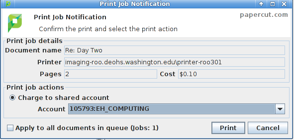
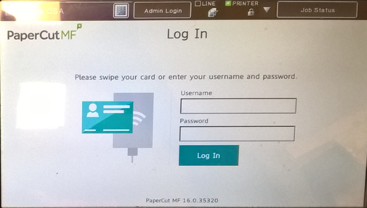

```{r set_knitr_options, echo=FALSE, message=FALSE}
suppressMessages(library(knitr))
opts_chunk$set(tidy=FALSE, cache=FALSE, echo=TRUE, message=FALSE)
```

## General Features

Our Sharp and Ricoh MFPs (Imaging Units), do:

- Stapling
- Duplexing (two-sided printing)
- Color
- Automatic Document Feeder
- Scanning to PDF

## Getting Started

**You Must Have**

- A DEOHS computer account, and a password
- A printing budget assigned to you

**When Printing**

- The Papercut client running on your computer
    - Department desktops do this by default
    - Laptops may require setup

# Printing

## Getting Connected

**Windows Desktops**

1) Click on the Imaging-Roo, or Imaging-MHSC icon on your desktop
2) Double-click on the printer you wish to add

**Apple Desktops**

- Submit a ticket requesting we add the printer to your computer

**Laptops**

- Submit a ticket for help, or visit portal for assistance

## Papercut

- Performs the billing for each print and copy request
- Before your print job is processed, you'll be able to review the cost



# Copying and Scanning

## Copying

- Requires a printing budget, and costs the same as printing
- If you have a Husky Card, you can link it to your account
    - Just swipe the card (reader is on the right-side), and follow the prompts



## Scanning

- Scanning is free
- Scans can be sent via email as PDF
    - Keep them under 15 pages, UW-IT limits email size
- On the Ricoh copiers, you can scan to a USB stick
    - Copier is a bit picky about USB sticks, it doesn't like some of them
    - There is no size limit for documents scanned to USB

# Questions
