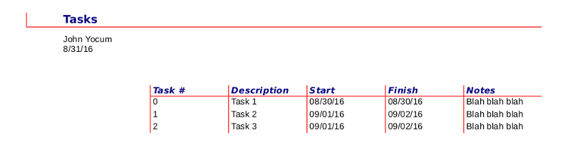
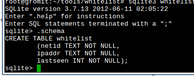

```{r set_knitr_options, echo=FALSE, message=FALSE}
suppressMessages(library(knitr))
opts_chunk$set(tidy=FALSE, cache=FALSE, echo=TRUE, message=FALSE)
```

## Purpose

- Data Import and Export
- Report Generation
- Data Entry Forms
- Information Processing

## Graphical Tools

- MySQL Workbench
- Access
- LibreOffice Base



## Command Line Tools {.columns-2}

- R
- Python
- mysql/psql (builtin tool)



## How do I choose one?

- What are others in your group using?
- Do you need to export information in a particular format?
- Will you be performing any analysis or other processing of the query results?

## Questions?
