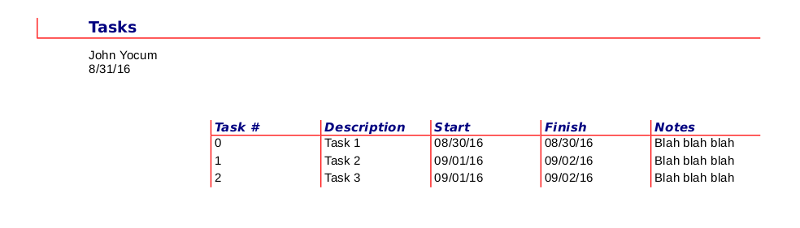
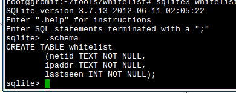

# Database Query Tools
John Yocum  
  

## Purpose

- Data Import and Export
    - Most tools can handle CSV, along with various other formats
- Report Generation
    - Tables
    - Charts
    - Formatted output
- Data Entry Forms
    - Customized forms (drop down menus, etc)
    - Some support adding logic
- Information Processing

## Graphical Tools

- MySQL Workbench
    - Limited to working with MySQL
    - Supports querying, visualize table relationships, and more
- Microsoft Access
    - Can function as a front-end for other database engines
    - Supports both form and report generation
- LibreOffice Base
    - Supports both form and report generation

## Command Line Tools

- R
    - Primary function is to perform analysis on data
    - Has an extensive array of database drivers
- Python
    - General purpose programming language
    - Has full support for interactive usage
    - Has extensive array of database drivers, and abstraction tools
- mysql/psql
    - Basic builtin tools
    - No form or report generation

## How do I choose one?

- What are others in your group using?
    - Everyone can follow the same process or procedure
    - Support for the same import and export formats
- Do you need to export information in a particular format?
    - Not all tools support the same export formats
- Will you be performing any analysis or other processing of the query results?
    - It may be best to query from within your analysis software (if possible)

## Questions?
