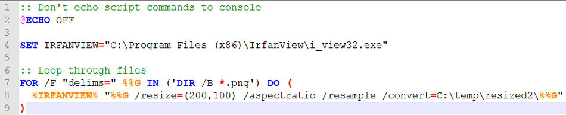
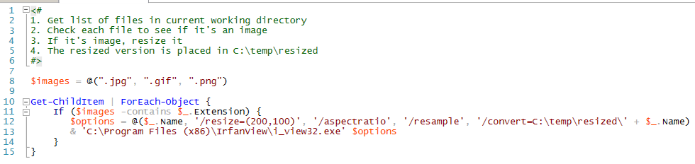

```{r set_knitr_options, echo=FALSE, message=FALSE}
suppressMessages(library(knitr))
opts_chunk$set(tidy=FALSE, cache=FALSE, echo=TRUE, message=FALSE)
```

# Batch Files

## Creating Scripts

- Use a Text Editor, such as Notepad++
- Save script with ".cmd" file extension

## Basic Elements: Variables

- Typically defined with the SET command
- There are exceptions like FOR loops which use %% syntax

```
SET IRFANVIEW="C:\Program Files (x86)\IrfanView\i_view32.exe"
```

## Basic Elements: Logic

## Basic Elements: Loops

- Batch files support the common FOR loop
- FOR loops iterate over a sequence of values
    - The value is available to the code within the loop
    - Loops are processed in order, they are not done in parallel

```
FOR /F "delims=" %%G IN ('DIR /B *.txt') DO (
  ECHO "%%G %%G.out"
)
```

## Running Batch Files

- You can double-click on them to run them
- Running them via a "Command Prompt" window may enable you to inspect errors more easily

## Batch Resize Images



# Powershell

## Creating Scripts

- Use the Powershell ISE (Integrated Scripting Environment)
- Save scripts with the ".ps1"" file extension

## Basic Elements: Variables

- Variable names are preceded by the $ symbol
- They are object oriented, inheriting the properties of whatever they contain

**Array**

```
$images = @(".jpg", ".gif", ".png")
```

**Properties**

```
$_.Name
```

## Basic Elements: Logic

- Most common, is the If-Else
    - Tests if a condition is true or false, and proceeds accordingly
    
```
    If ($images -contains $_.Extension) {
 
    }
```

## Basic Elements: Loops

**For**

- Iterate over a group of items
    - For, ForEach, ForEach-Object

```
Get-ChildItem | ForEach-Object {
    If ($_.FullName.EndsWith("txt")) {
        Write-Output $_.BaseName
        mkdir ('out2\' + $_.BaseName)
    }
}
```

**While**

- Run while a condition is true or false
    - While, and Do-While (true)
    - Do-Until (false)

## Running Powershell Scripts

- By default, Windows places security restrictions on scripts
    - One work-around is to open the script in the ISE, select the contents then "Run Selection"
- Using the ISE to run scripts, atleast when starting out
    - It will make it easier to troubleshoot, fix, and test again

## Batch Resize Images



