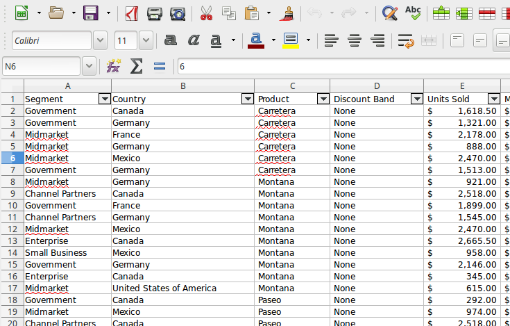
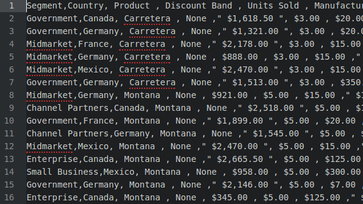

# Spreadsheets (and CSV files)
John Yocum  
  

# Spreadsheets

## Software

- Microsoft Excel (Mac, Windows)
- LibreOffice Calc (Mac, Windows, Linux)
- Numbers (Mac)

## Pros and Cons

**Benefits**

- Easy to use
- Lots of style/format options
- Low resource requirements

**Downsides**

- Problematic with large data sets
- Often stored in proprietary formats
- Difficult for multiple people to edit

# CSV Files

## Software

- Microsoft Excel (Mac, Windows)
- LibreOffice Calc (Mac, Windows, Linux)
- Any text editor

## Pros and Cons

**Benefits**

- Simple format with wide support
- Very low resource requirements
- Secure due to no macros

**Downsides**

- No formatting or styling
- No embedded formulas

# Questions?
